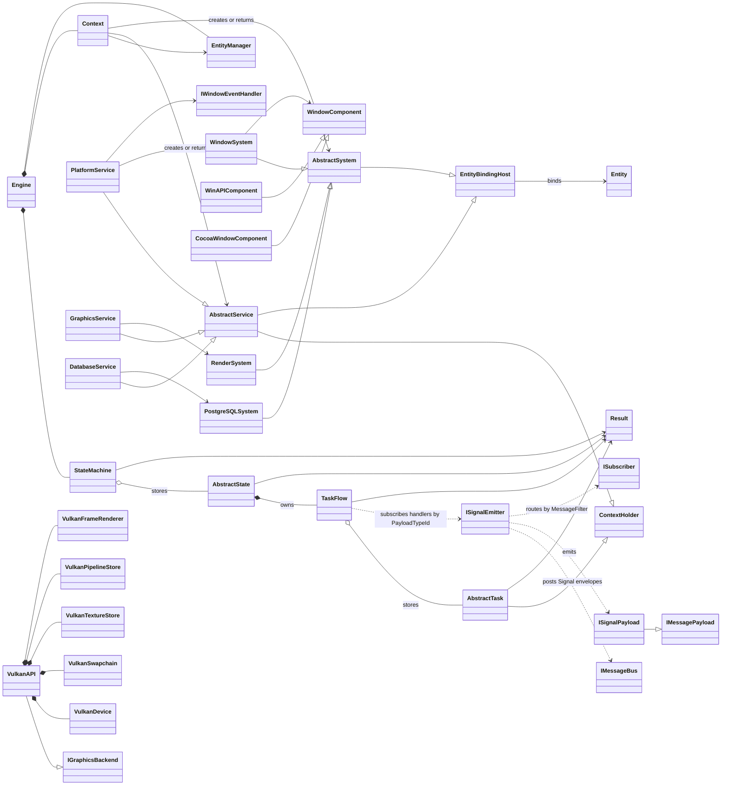

# Core Class Diagram

```mermaid
classDiagram
direction LR

class Engine
class StateMachine
class Context
class EntityManager
class Entity

class Result
class AbstractState
class TaskFlow
class AbstractTask
class ContextHolder
class EntityBindingHost

class AbstractService
class AbstractSystem

class PlatformService
class GraphicsService
class DatabaseService

class WindowSystem
class WindowComponent
class WinAPIComponent
class CocoaWindowComponent
class RenderSystem
class PostgreSQLSystem
class IWindowEventHandler

class ISignalEmitter
class ISignalPayload
class IMessagePayload
class ISubscriber
class IMessageBus

class IGraphicsBackend
class VulkanAPI
class VulkanDevice
class VulkanSwapchain
class VulkanTextureStore
class VulkanPipelineStore
class VulkanFrameRenderer

Engine *-- StateMachine
Engine *-- Context
Engine *-- EntityManager

StateMachine o-- AbstractState : stores
AbstractState *-- TaskFlow : owns
TaskFlow o-- AbstractTask : stores
TaskFlow ..> ISignalEmitter : subscribes handlers by PayloadTypeId

AbstractTask --|> ContextHolder
AbstractService --|> ContextHolder
AbstractService --|> EntityBindingHost
AbstractSystem --|> EntityBindingHost

Context --> EntityManager
Context --> AbstractService : creates or returns
Context --> AbstractSystem : creates or returns

PlatformService --|> AbstractService
GraphicsService --|> AbstractService
DatabaseService --|> AbstractService

WindowSystem --|> AbstractSystem
WinAPIComponent --|> WindowComponent
CocoaWindowComponent --|> WindowComponent
RenderSystem --|> AbstractSystem
PostgreSQLSystem --|> AbstractSystem

PlatformService --> WindowSystem
WindowSystem --> WindowComponent
PlatformService --> IWindowEventHandler
GraphicsService --> RenderSystem
DatabaseService --> PostgreSQLSystem

ISignalEmitter ..> IMessageBus : posts Signal envelopes
ISignalEmitter ..> ISignalPayload : emits
ISignalEmitter ..> ISubscriber : routes by MessageFilter
ISignalPayload --|> IMessagePayload

VulkanAPI --|> IGraphicsBackend
VulkanAPI *-- VulkanDevice
VulkanAPI *-- VulkanSwapchain
VulkanAPI *-- VulkanTextureStore
VulkanAPI *-- VulkanPipelineStore
VulkanAPI *-- VulkanFrameRenderer

EntityBindingHost --> Entity : binds
AbstractState --> Result
AbstractTask --> Result
StateMachine --> Result
TaskFlow --> Result
```
