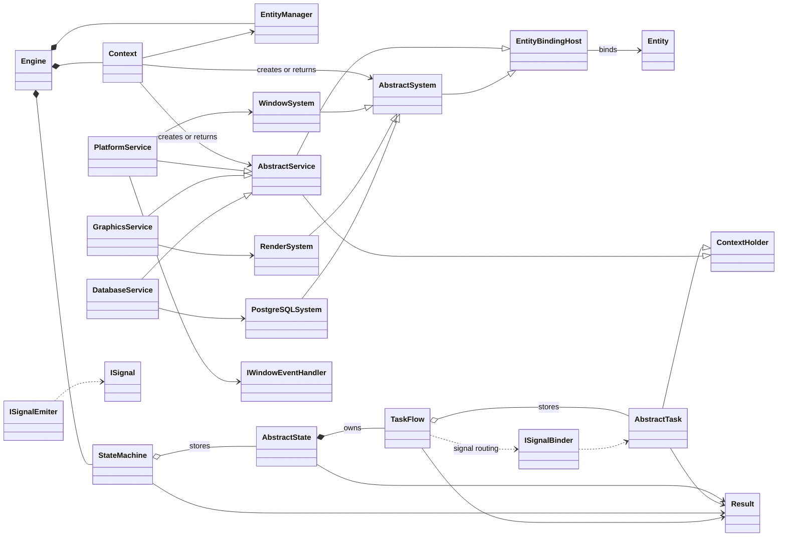

# Core Class Diagram

```mermaid
classDiagram
direction LR

class Engine
class StateMachine
class Context
class EntityManager
class Entity

class Result
class AbstractState
class TaskFlow
class AbstractTask
class ContextHolder
class EntityBindingHost

class AbstractService
class AbstractSystem

class PlatformService
class GraphicsService
class DatabaseService

class WindowSystem
class RenderSystem
class PostgreSQLSystem
class IWindowEventHandler

class ISignal
class ISignalEmiter
class ISignalBinder

Engine *-- StateMachine
Engine *-- Context
Engine *-- EntityManager

StateMachine o-- AbstractState : stores
AbstractState *-- TaskFlow : owns
TaskFlow o-- AbstractTask : stores
TaskFlow ..> ISignalBinder : signal routing

AbstractTask --|> ContextHolder
AbstractService --|> ContextHolder
AbstractService --|> EntityBindingHost
AbstractSystem --|> EntityBindingHost

Context --> EntityManager
Context --> AbstractService : creates or returns
Context --> AbstractSystem : creates or returns

PlatformService --|> AbstractService
GraphicsService --|> AbstractService
DatabaseService --|> AbstractService

WindowSystem --|> AbstractSystem
RenderSystem --|> AbstractSystem
PostgreSQLSystem --|> AbstractSystem

PlatformService --> WindowSystem
PlatformService --> IWindowEventHandler
GraphicsService --> RenderSystem
DatabaseService --> PostgreSQLSystem

ISignalEmiter ..> ISignal
ISignalBinder ..> AbstractTask

EntityBindingHost --> Entity : binds
AbstractState --> Result
AbstractTask --> Result
StateMachine --> Result
TaskFlow --> Result
```
