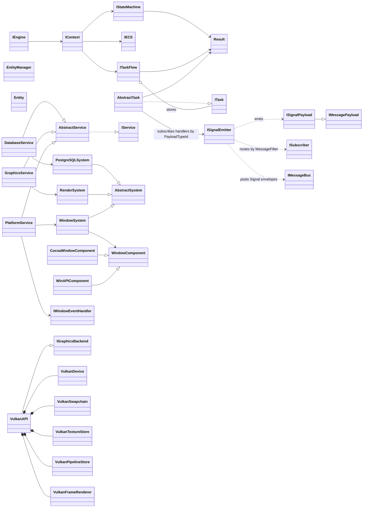

# Core Class Diagram

```mermaid
classDiagram
direction LR

class IEngine
class IStateMachine
class IContext
class IECS
class ITaskFlow
class EntityManager
class Entity

class Result
class ITask
class AbstractTask

class IService
class AbstractService
class AbstractSystem

class PlatformService
class GraphicsService
class DatabaseService

class WindowSystem
class WindowComponent
class WinAPIComponent
class CocoaWindowComponent
class RenderSystem
class PostgreSQLSystem
class IWindowEventHandler

class ISignalEmitter
class ISignalPayload
class IMessagePayload
class ISubscriber
class IMessageBus

class IGraphicsBackend
class VulkanAPI
class VulkanDevice
class VulkanSwapchain
class VulkanTextureStore
class VulkanPipelineStore
class VulkanFrameRenderer

IEngine --> IContext
IContext --> IStateMachine
IContext --> ITaskFlow
IContext --> IECS

ITaskFlow o-- ITask : stores
AbstractTask ..|> ITask
AbstractTask --> ISignalEmitter : subscribes handlers by PayloadTypeId

PlatformService --|> AbstractService
GraphicsService --|> AbstractService
DatabaseService --|> AbstractService
AbstractService ..|> IService

WindowSystem --|> AbstractSystem
WinAPIComponent --|> WindowComponent
CocoaWindowComponent --|> WindowComponent
RenderSystem --|> AbstractSystem
PostgreSQLSystem --|> AbstractSystem

PlatformService --> WindowSystem
WindowSystem --> WindowComponent
PlatformService --> IWindowEventHandler
GraphicsService --> RenderSystem
DatabaseService --> PostgreSQLSystem

ISignalEmitter ..> IMessageBus : posts Signal envelopes
ISignalEmitter ..> ISignalPayload : emits
ISignalEmitter ..> ISubscriber : routes by MessageFilter
ISignalPayload --|> IMessagePayload

VulkanAPI --|> IGraphicsBackend
VulkanAPI *-- VulkanDevice
VulkanAPI *-- VulkanSwapchain
VulkanAPI *-- VulkanTextureStore
VulkanAPI *-- VulkanPipelineStore
VulkanAPI *-- VulkanFrameRenderer

AbstractTask --> Result
ITaskFlow --> Result
IStateMachine --> Result
```
