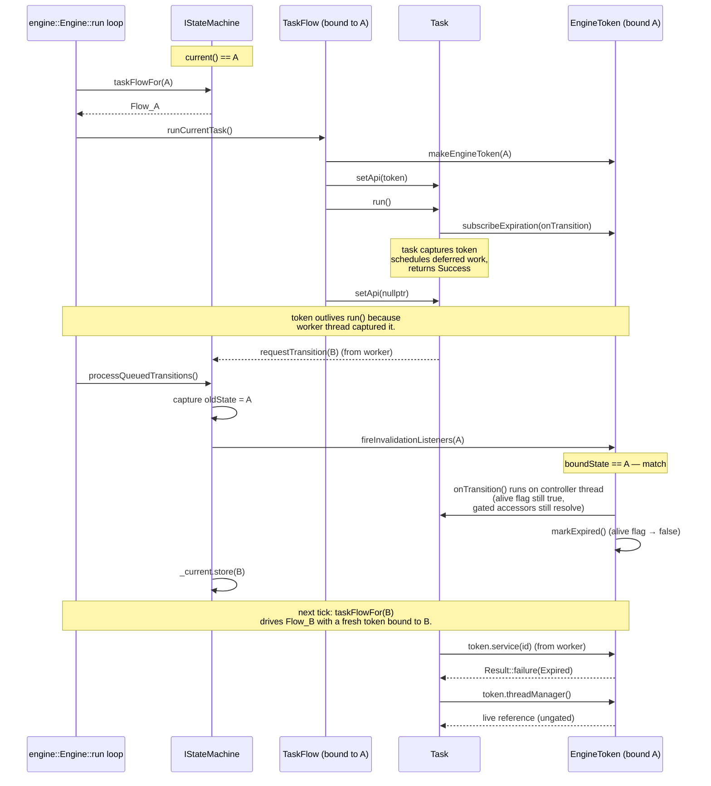

# Engine token (R-StateScope pattern)

`IEngineToken` is the state-scoped DI handle the engine hands to a task
when the task enters a state. While the bound state stays active, the
token resolves to live views of the engine API; the moment the FSM
leaves that state, every gated accessor on the token short-circuits to
`Result::Code::Expired`. The token behaves like `std::weak_ptr` over
state lifetime: the `boundState()` and `isAlive()` introspection
accessors stay queryable forever, but the `service / system /
entityManager / components / ecs` accessors stop dereferencing
recyclable registry slots the instant the state transition completes.

This page describes the R-StateScope rule: *what the token is, why it
exists, what each accessor returns, and how the lifecycle is driven by
the state machine*. It is the entry point for tasks that need to call
into the engine from inside a state hook.

## Motivation

Without a state-scoped wrapper, a task that captures `IContext&` at
`onEnter` keeps that reference forever. After the FSM transitions to
the next state, the task may run a deferred callback that:

- looks up a service id whose registry slot has since been recycled to
  a different service object — silent type confusion, no compile-time
  signal;
- iterates entities through an `IEntityManager` whose snapshot was
  pruned by the new state's `onEnter` — stale ids, hard-to-debug
  no-ops;
- resolves an `ISystem` that the new state never registered — a null
  pointer where the original `onEnter` saw a live system.

The R-StateScope rule replaces "task captures `IContext&`" with "task
receives an `IEngineToken&` bound to its state". The token's gated
accessors check `isAlive()` first and short-circuit to a typed
`Result::Code::Expired` once the bound state has been invalidated. A
deferred callback that runs after the transition therefore observes
**one** typed reason rather than three different undefined-behaviour
modes. The cost is a single relaxed atomic load on the alive flag per
gated lookup; the saving is "FSM transitions invalidate every stale
state-scoped reference uniformly, by construction".

## Class pyramid

`IEngineToken` ships in three tiers, mirroring the
[INV-10 naming convention](../../include/vigine/api/engine/iengine_token.h)
the rest of the engine follows (`I` prefix for pure-virtual
interfaces, `Abstract` prefix for stateful base classes):

| Tier               | Class                                                                                                   | Role                                                                                                                                                                            |
|--------------------|---------------------------------------------------------------------------------------------------------|---------------------------------------------------------------------------------------------------------------------------------------------------------------------------------|
| Pure interface     | [`IEngineToken`](../../include/vigine/api/engine/iengine_token.h) (#220)                                | No state, no method bodies. Declares the full accessor surface plus `boundState`, `isAlive`, and `subscribeExpiration`.                                                         |
| Stateful base      | [`AbstractEngineToken`](../../include/vigine/api/engine/abstractengine_token.h) (#220)                  | Owns the two pieces of token state every concrete subclass shares: an immutable `boundState` and an atomic `_alive` flag. Implements `boundState()` and `isAlive()` on top.     |
| Concrete `final`   | [`EngineToken`](../../include/vigine/impl/engine/enginetoken.h) (#287)                                  | Seals the chain. Wires the gated accessors through `IContext`, registers the FSM invalidation listener, and exposes `subscribeExpiration` over an internal callback registry.   |

Tasks always see the pure-interface tier: the state machine hands them
an `IEngineToken&`, never a concrete `EngineToken*`.

## Hybrid gating model

The token API is split into two halves on purpose. The split is the
heart of the R-StateScope rule:

### Domain accessors (gated, return `Result<T>`)

| Accessor                        | Resource                          | Failure modes                                                              |
|---------------------------------|-----------------------------------|----------------------------------------------------------------------------|
| `service(ServiceId id)`         | `vigine::service::IService&`      | `Expired` (token dropped); `NotFound` (id invalid or registry slot recycled) |
| `system(SystemId id)`           | `vigine::ecs::ISystem&`           | `Expired` (token dropped); `Unavailable` (always today, #197 follow-up wires the lookup) |
| `entityManager()`               | `vigine::IEntityManager&`         | `Expired` (token dropped); `Unavailable` (always today, #197 follow-up)    |
| `components()`                  | `vigine::IComponentManager&`      | `Expired` (token dropped); `Unavailable` (always today, #197 follow-up)    |
| `ecs()`                         | `vigine::ecs::IECS&`              | `Expired` (token dropped); otherwise `Ok` -- the context never returns a partial wrapper |

These resources sit in registries the engine may recycle between ticks
or across state transitions. The first thing each gated accessor does
is `isAlive()`: a `false` return short-circuits to
`Result::Code::Expired` without ever reaching the context. While the
token is still alive, the call delegates to `IContext` and translates
the lookup outcome into the `Result` wrapper. Callers branch on
`code()` and pull the live reference through `value()`:

```cpp
auto outcome = token.service(myServiceId);
if (!outcome.ok()) {
    // outcome.code() is Expired or NotFound for service().
    // Treat Expired as a graceful no-op (the FSM has moved on);
    // NotFound is a real error the caller must report.
    return outcome.code() == decltype(outcome)::Code::Expired
        ? Result(Result::Code::Success)
        : Result(Result::Code::Error, "service unavailable");
}
vigine::service::IService& svc = outcome.value();
// ... safe to use svc until the next state transition.
```

### Infrastructure accessors (non-gated, return `T&`)

| Accessor              | Resource                                              | Why ungated                                                                                                                                |
|-----------------------|-------------------------------------------------------|--------------------------------------------------------------------------------------------------------------------------------------------|
| `threadManager()`     | `vigine::core::threading::IThreadManager&`            | Built first in the context construction chain, torn down last. Outlives every state.                                                       |
| `systemBus()`         | `vigine::messaging::IMessageBus&`                     | Engine-wide message bus. Owned by the context for its whole lifetime.                                                                      |
| `signalEmitter()`     | `vigine::messaging::ISignalEmitter&`                  | The engine-wide signal emitter façade. Falls back to a file-private no-op stub when the wiring follow-up under #283 has not yet landed.    |
| `stateMachine()`      | `vigine::statemachine::IStateMachine&`                | The state machine that drives the token itself. By construction outlives every token it has issued.                                        |

These accessors return references directly because the resources
behind them are engine-lifetime singletons. A task that has
already-expired its token can still drain in-flight `threadManager()`
work, post a follow-up `systemBus()` message, or query
`stateMachine().current()` to see where the FSM has moved. **Reaching
into a domain accessor after expiration is a bug; reaching into an
infrastructure accessor after expiration is the supported path for
graceful drain.**

The split is intentional. A task that has been dropped on a state
transition still needs to drain. Forcing every accessor through the
gate would make the drain path itself fail, defeating the purpose of
"graceful state hand-off". The hybrid policy lets domain code fail
loudly while infrastructure code keeps working.

## Self-destruct contract

A task that needs to react to its own expiration registers a callback
through `subscribeExpiration`:

```cpp
auto sub = token.subscribeExpiration([&]() {
    // FSM has transitioned away from boundState. Cancel any deferred
    // pool work this task posted, drop cached service handles, etc.
    cancelInFlightDecode();
});
```

Contract:

- The callback is invoked **exactly once**, when the FSM transitions
  away from the bound state. A second transition does not re-fire it.
- The callback runs **synchronously on the controller thread** —
  whichever thread executed the FSM transition. The
  [`IStateMachine` thread-affinity contract](../sequence-engine-state.md)
  guarantees that this is the controller thread.
- The callback runs **before** any `onExit` hook of the vacated state,
  inside `AbstractStateMachine::fireInvalidationListeners`, so a
  callback that calls back into `stateMachine().current()` observes the
  **old** active state and not the new one.
- `subscribeExpiration` returns `nullptr` when the supplied callback
  is empty or when the token is already expired at registration time
  — there is nothing left to fire. **Always null-check the returned
  `unique_ptr<ISubscriptionToken>` before dereferencing it.**
- Dropping the returned subscription token before expiration cleanly
  detaches the callback. The token holds the subscription as RAII; no
  manual `cancel()` is required for the common case.

## Lifecycle: per-state, FSM-driven (post-#334)

The token's lifecycle is bound to the FSM state under which the engine
issued it, NOT to a single `run()` call on the task that holds it. The
engine's main pump (`vigine::engine::Engine::run`, see
[`src/api/engine/abstractengine.cpp`](../../src/api/engine/abstractengine.cpp))
walks the following per-tick shape:

1. Read `IStateMachine::current()` — call it *S*.
2. Look up `IStateMachine::taskFlowFor(S)`. A `nullptr` result means no
   work is registered for the active state and the tick falls through
   to the FSM drain + main-thread pump alone.
3. When a flow is bound, advance it by exactly one task via
   `TaskFlow::runCurrentTask`. That call mints an engine token, binds
   it on the task with `setApi`, runs `ITask::run` synchronously, then
   clears the binding and drops the token (RAII via `ApiBindingGuard`).
4. Drain queued FSM transitions on the controller thread
   (`processQueuedTransitions`). A `requestTransition(T)` call posted
   from inside the just-finished task lands here and updates the FSM
   to *T*.
5. Pump the thread manager's main-thread queue.
6. Sleep until the next pump tick or a `shutdown()` notify.

Two consequences for the token narrative:

- **Per-state TaskFlow scoping.** The flow that runs at tick *N+1* is
  the flow bound to whatever state the FSM transitioned to during tick
  *N*. A single FSM session therefore drives a *sequence* of TaskFlows,
  one per active state, and the engine token a task observes inside
  `run()` is mint-fresh for that tick rather than being shared across
  states.
- **Expiration is now a real mid-flight event.** A long-running task
  that hands its token (or a `subscribeExpiration` handle) to a worker
  thread or an external owner can outlive the FSM transition that
  invalidates the bound state. When the controller thread later applies
  a queued `requestTransition` in step 4, the listener fires
  synchronously on the controller thread and every still-live token
  bound to the vacated state flips to expired. Callbacks registered
  against those tokens run *before* the alive flag flips, so cleanup
  code may still drain a service handle or post a final bus message
  while the token remains gated-live.

> Honest current state of the state-id binding: at this leaf the token
> minted inside `TaskFlow::runCurrentTask` still carries the
> sentinel-default `vigine::statemachine::StateId{}` rather than
> `IStateMachine::current()`. The lookup that seeds the bound state on
> the per-tick mint is flagged as a follow-up on
> [`src/impl/taskflow/taskflow.cpp`](../../src/impl/taskflow/taskflow.cpp)
> and the engine docstring at
> [`src/api/engine/abstractengine.cpp`](../../src/api/engine/abstractengine.cpp).
> Tokens minted directly through `IContext::makeEngineToken(stateId)`
> (the canonical path used by the contract suite — see scenario_21 /
> scenario_22) bind to the supplied `StateId` and observe the full
> per-state lifecycle described in this section. New code should mint
> through that surface; the legacy sentinel path stays in place only
> for tasks still on the `ContextHolder` mixin.

The state machine drives invalidation through an
invalidation-listener registry on `AbstractStateMachine`. The diagram
below shows what happens for a token bound to state *A* over an FSM
session that transitions *A → B* mid-way through a long task:



Three ordering details worth highlighting:

1. **Callbacks fire BEFORE the alive flag flips.**
   `EngineToken::onStateInvalidated` calls `fireExpirationCallbacks()`
   first and only then `markExpired()`. While a callback runs,
   `isAlive()` still returns `true` and the gated accessors still
   resolve, which is what lets a callback issue last-mile cleanup
   that depends on a live token (drain a service handle, post a
   final bus message, and so on).
2. **Listeners fire BEFORE `_current` flips.** `transition()` captures
   `oldState` first, calls `fireInvalidationListeners(oldState)`, and
   *then* stores the new state. A listener that calls back into
   `stateMachine().current()` therefore sees the OLD active state, not
   the NEW one. This ordering is asserted in the engine-token smoke
   suite (`test/engine_token/smoke_test.cpp`).
3. **No-op transitions do not fire the listener.** A
   `transition(stateA)` call when `_current == stateA` returns success
   with no side effect, and no token bound to `stateA` is invalidated.
   Idempotent `transition(currentState)` is therefore safe.

A bus-level signal payload —
[`StateInvalidatedPayload`](../../include/vigine/api/messaging/payload/stateinvalidatedpayload.h) —
ships under the messaging tree to let signal-emitter subscribers
observe the same event without owning a token. Its emission from
inside the FSM transition path is a follow-up issue (the payload
header lands first so payload registration code can compile against
the contract). Once the emitter wiring lands, FSM transitions will
publish the payload on the system bus immediately after the listener
broadcast above, on the same controller thread, before `_current` is
flipped to the new state.

## Code example

### A: minimal state-scoped work

A task that wants both a service handle and a clean-up hook on
state-exit looks like this. The example mirrors the engine-token smoke
suite (`test/engine_token/smoke_test.cpp`) which is the canonical
reference for the contract.

```cpp
#include "vigine/api/context/factory.h"
#include "vigine/api/context/icontext.h"
#include "vigine/api/engine/iengine_token.h"
#include "vigine/api/messaging/isubscriptiontoken.h"
#include "vigine/api/service/serviceid.h"
#include "vigine/result.h"

void runStateScopedWork(vigine::IContext &ctx,
                        vigine::statemachine::StateId boundState,
                        vigine::service::ServiceId    workerId)
{
    // 1. Mint a token bound to the current state. The engine pumps
    //    the state-bound TaskFlow each tick (see
    //    AbstractEngine::run); the explicit factory call here is
    //    the unit-test-style shape.
    auto token = ctx.makeEngineToken(boundState);
    if (!token) {
        return; // legacy stub context cannot mint a live token.
    }

    // 2. Register a clean-up hook before any side effect. The lambda
    //    fires once on the controller thread when the FSM leaves
    //    boundState, before _current flips to the new state.
    auto sub = token->subscribeExpiration([]() {
        // cancel deferred decoder work, drop cached handles, etc.
    });

    // 3. Resolve a domain handle through the gated accessor.
    auto outcome = token->service(workerId);
    if (!outcome.ok()) {
        // Two failure modes the service() accessor reports today
        // (see src/impl/engine/enginetoken.cpp):
        //   - Expired:  state has already changed — bail out.
        //   - NotFound: workerId is the invalid sentinel or its
        //               registry slot has been recycled.
        return;
    }
    vigine::service::IService &worker = outcome.value();

    // 4. Reach an infrastructure resource through the ungated
    //    accessor. Even after the token expires, this reference
    //    keeps working — that is what lets a task drain in-flight
    //    pool work after a state transition.
    vigine::core::threading::IThreadManager &tm = token->threadManager();
    // Pseudo-code: the real IThreadManager::schedule signature takes
    //   std::unique_ptr<IRunnable> runnable, ThreadAffinity affinity
    // (see include/vigine/core/threading/ithreadmanager.h). A
    // production caller wraps the closure in an IRunnable subclass
    // (or a project-wide LambdaRunnable adapter) before the call.
    // (void)tm.schedule(makeRunnable([&worker]() { /* drain */ }),
    //                   vigine::core::threading::ThreadAffinity::Pool);
}
```

The two failure modes a task **must** handle:

- `outcome.ok() == false` and `outcome.code() == Expired` — the FSM
  has moved on. Skip the work; the bookkeeping has already been done
  by the expiration callback registered in step 2. The smoke suite's
  scenario 2 exercises exactly this path.
- `sub == nullptr` from `subscribeExpiration` — either the lambda was
  empty or the token was already expired at registration time. The
  smoke suite's scenario 3 exercises the latter.

### B: long-running render task that releases GPU resources on transition

The example below sketches a render task wired into a `WorkState`
TaskFlow. The task posts a long-running render job to the thread pool
from inside `run()`, captures its engine token, and uses
`subscribeExpiration` to cancel the in-flight GPU work and free the
GPU resources the moment the FSM transitions to a `CloseState`. Wiring
the flow into the FSM goes through
[`IStateMachine::addStateTaskFlow`](../../include/vigine/api/statemachine/istatemachine.h);
the engine then drives `Flow_Work` per tick while the FSM rests in
`workState`, and switches to `Flow_Close` automatically once a
`requestTransition(closeState)` is drained on the controller thread.

```cpp
#include "vigine/api/context/icontext.h"
#include "vigine/api/engine/factory.h"
#include "vigine/api/engine/iengine.h"
#include "vigine/api/engine/iengine_token.h"
#include "vigine/api/messaging/isubscriptiontoken.h"
#include "vigine/api/statemachine/istatemachine.h"
#include "vigine/api/taskflow/abstracttask.h"
#include "vigine/result.h"

#include <atomic>
#include <memory>

namespace myproject {

class RenderFrameTask final : public vigine::AbstractTask
{
  public:
    RenderFrameTask() = default;

    [[nodiscard]] vigine::Result run() override
    {
        // The engine binds the token before each run() invocation
        // (see TaskFlow::runCurrentTask). For a long render, capture
        // the token pointer up front so the deferred worker can reach
        // through the gated accessors and observe Expired the moment
        // the FSM transitions to CloseState.
        auto *token = api();
        if (token == nullptr)
            return vigine::Result(vigine::Result::Code::Error,
                                  "render task missing engine token");

        // Allocate the GPU buffers we'll need across tick boundaries.
        // Real code would resolve the GPU service via token->service().
        _gpuBuffers = std::make_shared<GpuBuffers>();

        // Subscribe to bound-state expiration so we get a
        // controller-thread callback the moment the FSM transitions
        // out of WorkState (typically CloseState). The callback runs
        // BEFORE the alive flag flips, so we still have a gated-live
        // token to drain through.
        _expiration = token->subscribeExpiration([buffers = _gpuBuffers,
                                                  &cancelled = _cancelled]() {
            // 1. Mark in-flight render work cancelled so the worker
            //    thread bails out at its next polling point.
            cancelled.store(true, std::memory_order_release);
            // 2. Release the GPU resources held by the buffers shared
            //    pointer. The worker thread observes the cancel flag
            //    and drops its own copy; this branch handles the case
            //    where CloseState has been reached before the worker
            //    even started.
            buffers->release();
        });

        // Schedule the render on the engine's thread pool. The
        // closure captures the token + buffers by value (shared_ptr)
        // so they outlive run(). Ungated accessors stay live even
        // after expiration; the gated render-resource lookups branch
        // on Expired and exit cooperatively.
        auto &tm = token->threadManager();
        // (void)tm.schedule(makeRunnable([token, buffers = _gpuBuffers,
        //                                 &cancelled = _cancelled]() {
        //     while (!cancelled.load(std::memory_order_acquire)) {
        //         auto frame = token->ecs(); // gated: Expired on transition
        //         if (!frame.ok()) break;    // FSM walked into CloseState
        //         renderTo(buffers, frame.value());
        //     }
        // }), vigine::core::threading::ThreadAffinity::Pool);
        (void)tm;

        return vigine::Result(vigine::Result::Code::Success);
    }

  private:
    struct GpuBuffers {
        void release() { /* free textures, command lists, etc. */ }
    };

    std::shared_ptr<GpuBuffers>                            _gpuBuffers;
    std::atomic<bool>                                      _cancelled{false};
    std::unique_ptr<vigine::messaging::ISubscriptionToken> _expiration;
};

} // namespace myproject
```

What the engine does with this task once it is wired into a state-bound
flow (`IStateMachine::addStateTaskFlow(workState, std::move(flow))`):

1. While `current() == workState`, every tick mints a fresh token
   bound to the work state, binds it on the task, calls `run()`, drops
   the binding, and lets the per-tick token expire at end of tick.
   `subscribeExpiration` callbacks registered against THAT per-tick
   token fire on the next FSM transition out of `workState`.
2. The task captured its long-running buffers + cancellation flag in
   `_gpuBuffers` / `_cancelled`, both members of the task instance,
   not of any single token. So the deferred worker thread keeps making
   progress across multiple ticks even though each tick's token comes
   and goes.
3. Once the controller thread drains a `requestTransition(closeState)`
   request, the listener registry fires every callback on every still
   -live token bound to `workState` — including the one this task
   registered. The lambda flips `_cancelled` and releases the GPU
   buffers; the worker observes the flag and exits cooperatively.
4. The next engine tick reads `current() == closeState` and drives the
   flow registered for `closeState` instead. `Flow_Work` is no longer
   pumped — the FSM-driven engine swap is what takes the render task
   off the schedule.

## Cross-references

- Pure interface, gating-policy contract:
  [`include/vigine/api/engine/iengine_token.h`](../../include/vigine/api/engine/iengine_token.h)
  (#220).
- Stateful base (alive flag, bound-state accessor):
  [`include/vigine/api/engine/abstractengine_token.h`](../../include/vigine/api/engine/abstractengine_token.h)
  (#220).
- Concrete final + FSM listener wiring:
  [`include/vigine/impl/engine/enginetoken.h`](../../include/vigine/impl/engine/enginetoken.h),
  [`src/impl/engine/enginetoken.cpp`](../../src/impl/engine/enginetoken.cpp)
  (#287).
- Factory on the context:
  [`IContext::makeEngineToken`](../../include/vigine/api/context/icontext.h)
  (#286).
- FSM-side invalidation registry and listener firing path:
  [`AbstractStateMachine::addInvalidationListener` / `fireInvalidationListeners`](../../include/vigine/api/statemachine/abstractstatemachine.h)
  (#287).
- Per-state TaskFlow registry on the FSM:
  [`IStateMachine::addStateTaskFlow` / `taskFlowFor`](../../include/vigine/api/statemachine/istatemachine.h)
  (#334).
- Engine-side per-tick pump that walks `taskFlowFor(current())` each
  tick and binds a token before `runCurrentTask`:
  [`src/api/engine/abstractengine.cpp`](../../src/api/engine/abstractengine.cpp)
  (#334).
- Task-side companion doc covering `ITask::api()` and the
  setApi/run/setApi(nullptr) lifecycle:
  [`doc/ecs/system.md`](system.md).
- Contract scenarios for stale token + expiration callback semantics:
  [`test/contract/scenario_21_stale_engine_token.cpp`](../../test/contract/scenario_21_stale_engine_token.cpp),
  [`test/contract/scenario_22_token_expiration_callback.cpp`](../../test/contract/scenario_22_token_expiration_callback.cpp).
- Bus-level signal payload (header only; emission wiring follows):
  [`StateInvalidatedPayload`](../../include/vigine/api/messaging/payload/stateinvalidatedpayload.h).
- Reference smoke suite for the contract:
  [`test/engine_token/smoke_test.cpp`](../../test/engine_token/smoke_test.cpp)
  (#287).
- Threading contract for the controller thread the listener path runs
  on: [`doc/threading/overview.md`](../threading/overview.md).
