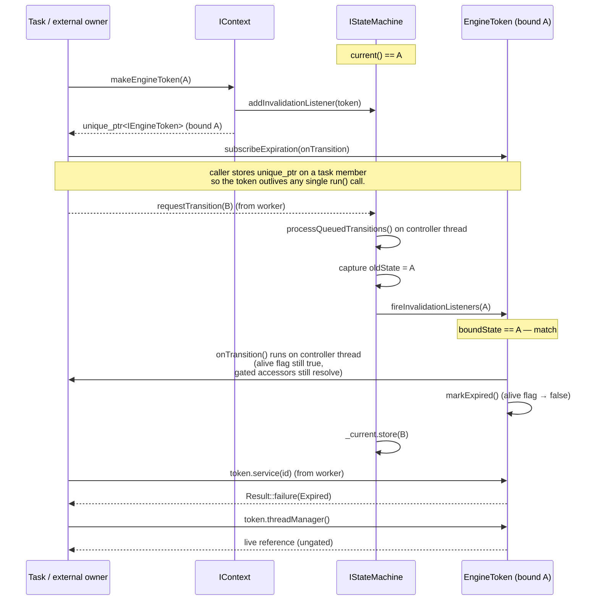

# Engine token (R-StateScope pattern)

`IEngineToken` is the state-scoped DI handle the engine hands to a task
during a `run()` invocation. While the bound state stays active, the
token resolves to live views of the engine API; the moment the FSM
leaves that state, every gated accessor on the token short-circuits to
`Result::Code::Expired`. The token behaves like `std::weak_ptr` over
state lifetime: the `boundState()` and `isAlive()` introspection
accessors stay queryable forever, but the `service / system /
entityManager / components / ecs` accessors stop dereferencing
recyclable registry slots the instant the state transition completes.

This page describes the R-StateScope rule: *what the token is, why it
exists, what each accessor returns, and how the lifecycle is driven by
the state machine*. It is the entry point for tasks that need to call
into the engine from inside a state hook.

> **Two realities to keep separate while reading this page.** The token
> contract — gated accessors, expiration callback, alive flag — is
> already pinned down by the contract suite (scenario_21 / scenario_22)
> and the engine-token smoke test. The wiring that mints tokens and
> hands them to tasks lands in two stages:
> - **Current wiring (post-#334).** The per-tick mint inside
>   `TaskFlow::runCurrentTask` passes a sentinel-default
>   `vigine::statemachine::StateId{}` and destroys the
>   `unique_ptr<IEngineToken>` at the end of the per-task scope, so the
>   pointer the task observes through `api()` does **not** outlive the
>   single `run()` call and the bound-state field is the sentinel
>   rather than `IStateMachine::current()`. Tokens minted directly
>   through `IContext::makeEngineToken(stateId)` (the path the contract
>   suite uses) bind to the supplied `StateId` and observe the full
>   per-state lifecycle described below; their `unique_ptr` is owned by
>   the caller and can outlive `run()` if the caller chooses to keep it
>   alive.
> - **Intended (post-#343 ITaskFlow redesign).** The per-tick mint will
>   thread `IStateMachine::current()` into the bound state, and the
>   token will outlive the single `run()` call so a worker thread that
>   captured the pointer observes a real mid-flight expiration when the
>   FSM transitions away from the bound state. The contract narrative
>   in the rest of this page describes the post-#343 reality; the
>   "Lifecycle" section calls out which slices already hold today.

## Motivation

Without a state-scoped wrapper, a task that captures `IContext&` at
`onEnter` keeps that reference forever. After the FSM transitions to
the next state, the task may run a deferred callback that:

- looks up a service id whose registry slot has since been recycled to
  a different service object — silent type confusion, no compile-time
  signal;
- iterates entities through an `IEntityManager` whose snapshot was
  pruned by the new state's `onEnter` — stale ids, hard-to-debug
  no-ops;
- resolves an `ISystem` that the new state never registered — a null
  pointer where the original `onEnter` saw a live system.

The R-StateScope rule replaces "task captures `IContext&`" with "task
receives an `IEngineToken&` bound to its state". The token's gated
accessors check `isAlive()` first and short-circuit to a typed
`Result::Code::Expired` once the bound state has been invalidated. A
deferred callback that runs after the transition therefore observes
**one** typed reason rather than three different undefined-behaviour
modes. The cost is a single relaxed atomic load on the alive flag per
gated lookup; the saving is "FSM transitions invalidate every stale
state-scoped reference uniformly, by construction".

## Class pyramid

`IEngineToken` ships in three tiers, mirroring the
[INV-10 naming convention](../../include/vigine/api/engine/iengine_token.h)
the rest of the engine follows (`I` prefix for pure-virtual
interfaces, `Abstract` prefix for stateful base classes):

| Tier               | Class                                                                                                   | Role                                                                                                                                                                            |
|--------------------|---------------------------------------------------------------------------------------------------------|---------------------------------------------------------------------------------------------------------------------------------------------------------------------------------|
| Pure interface     | [`IEngineToken`](../../include/vigine/api/engine/iengine_token.h) (#220)                                | No state, no method bodies. Declares the full accessor surface plus `boundState`, `isAlive`, and `subscribeExpiration`.                                                         |
| Stateful base      | [`AbstractEngineToken`](../../include/vigine/api/engine/abstractengine_token.h) (#220)                  | Owns the two pieces of token state every concrete subclass shares: an immutable `boundState` and an atomic `_alive` flag. Implements `boundState()` and `isAlive()` on top.     |
| Concrete `final`   | [`EngineToken`](../../include/vigine/impl/engine/enginetoken.h) (#287)                                  | Seals the chain. Wires the gated accessors through `IContext`, registers the FSM invalidation listener, and exposes `subscribeExpiration` over an internal callback registry.   |

Tasks always see the pure-interface tier: the state machine hands them
an `IEngineToken&`, never a concrete `EngineToken*`.

## Hybrid gating model

The token API is split into two halves on purpose. The split is the
heart of the R-StateScope rule:

### Domain accessors (gated, return `Result<T>`)

| Accessor                        | Resource                          | Failure modes                                                              |
|---------------------------------|-----------------------------------|----------------------------------------------------------------------------|
| `service(ServiceId id)`         | `vigine::service::IService&`      | `Expired` (token dropped); `NotFound` (id invalid or registry slot recycled) |
| `system(SystemId id)`           | `vigine::ecs::ISystem&`           | `Expired` (token dropped); `Unavailable` (always today, #197 follow-up wires the lookup) |
| `entityManager()`               | `vigine::IEntityManager&`         | `Expired` (token dropped); `Unavailable` (always today, #197 follow-up)    |
| `components()`                  | `vigine::IComponentManager&`      | `Expired` (token dropped); `Unavailable` (always today, #197 follow-up)    |
| `ecs()`                         | `vigine::ecs::IECS&`              | `Expired` (token dropped); otherwise `Ok` -- the context never returns a partial wrapper |

These resources sit in registries the engine may recycle between ticks
or across state transitions. The first thing each gated accessor does
is `isAlive()`: a `false` return short-circuits to
`Result::Code::Expired` without ever reaching the context. While the
token is still alive, the call delegates to `IContext` and translates
the lookup outcome into the `Result` wrapper. Callers branch on
`code()` and pull the live reference through `value()`:

```cpp
auto outcome = token.service(myServiceId);
if (!outcome.ok()) {
    // outcome.code() is Expired or NotFound for service().
    // Treat Expired as a graceful no-op (the FSM has moved on);
    // NotFound is a real error the caller must report.
    return outcome.code() == decltype(outcome)::Code::Expired
        ? Result(Result::Code::Success)
        : Result(Result::Code::Error, "service unavailable");
}
vigine::service::IService& svc = outcome.value();
// ... safe to use svc until the next state transition.
```

### Infrastructure accessors (non-gated, return `T&`)

| Accessor              | Resource                                              | Why ungated                                                                                                                                |
|-----------------------|-------------------------------------------------------|--------------------------------------------------------------------------------------------------------------------------------------------|
| `threadManager()`     | `vigine::core::threading::IThreadManager&`            | Built first in the context construction chain, torn down last. Outlives every state.                                                       |
| `systemBus()`         | `vigine::messaging::IMessageBus&`                     | Engine-wide message bus. Owned by the context for its whole lifetime.                                                                      |
| `signalEmitter()`     | `vigine::messaging::ISignalEmitter&`                  | The engine-wide signal emitter façade. Falls back to a file-private no-op stub when the wiring follow-up under #283 has not yet landed.    |
| `stateMachine()`      | `vigine::statemachine::IStateMachine&`                | The state machine that drives the token itself. By construction outlives every token it has issued.                                        |

These accessors return references directly because the resources
behind them are engine-lifetime singletons. A task that has
already-expired its token can still drain in-flight `threadManager()`
work, post a follow-up `systemBus()` message, or query
`stateMachine().current()` to see where the FSM has moved. **Reaching
into a domain accessor after expiration is a bug; reaching into an
infrastructure accessor after expiration is the supported path for
graceful drain.**

The split is intentional. A task that has been dropped on a state
transition still needs to drain. Forcing every accessor through the
gate would make the drain path itself fail, defeating the purpose of
"graceful state hand-off". The hybrid policy lets domain code fail
loudly while infrastructure code keeps working.

## Self-destruct contract

A task that needs to react to its own expiration registers a callback
through `subscribeExpiration`:

```cpp
auto sub = token.subscribeExpiration([&]() {
    // FSM has transitioned away from boundState. Cancel any deferred
    // pool work this task posted, drop cached service handles, etc.
    cancelInFlightDecode();
});
```

The returned `std::unique_ptr<ISubscriptionToken>` MUST be stored on
something that outlives the moment of the FSM transition the
subscription is meant to observe — typically a task member field or
some other long-lived owner. Dropping the handle before the
transition cleanly detaches the callback (the destructor blocks on
any in-flight callback dispatch), which is fine for cancellation but
defeats the point of subscribing. The handle must NOT be stored on
the per-tick token itself: that token is owned by
`TaskFlow::runCurrentTask` and destroyed at end of scope, so the
subscription would fire (or be torn down) at that destruction point
rather than on a real FSM transition. See
[`system.md`](system.md#long-running-task-state-bound-work-that-observes-expired-mid-flight)
for the canonical task-side wiring (FSM-bound token parked on a task
member, subscription handle stored alongside).

Contract:

- The callback is invoked **exactly once**, when the FSM transitions
  away from the bound state. A second transition does not re-fire it.
- The callback runs **synchronously on the controller thread** —
  whichever thread executed the FSM transition. The
  [`IStateMachine` thread-affinity contract](../sequence-engine-state.md)
  guarantees that this is the controller thread.
- The callback runs **before** any `onExit` hook of the vacated state,
  inside `AbstractStateMachine::fireInvalidationListeners`, so a
  callback that calls back into `stateMachine().current()` observes the
  **old** active state and not the new one.
- `subscribeExpiration` returns `nullptr` when the supplied callback
  is empty or when the token is already expired at registration time
  — there is nothing left to fire. **Always null-check the returned
  `unique_ptr<ISubscriptionToken>` before dereferencing it.**
- Dropping the returned subscription token before expiration cleanly
  detaches the callback. The token holds the subscription as RAII; no
  manual `cancel()` is required for the common case.

## Lifecycle

The token's lifecycle is driven by the FSM transition listener on the
concrete `EngineToken`: when the FSM transitions out of the
`boundState()` the token was minted with, the listener fires every
registered expiration callback synchronously on the controller thread
and then flips the alive flag to `false`. From that point on, every
gated accessor short-circuits to `Result::Code::Expired` without
touching the engine. The infrastructure accessors (`threadManager`,
`systemBus`, `signalEmitter`, `stateMachine`) keep returning the
engine-lifetime singletons unchanged.

The contract above is what `EngineToken` itself implements and what
scenario_21 / scenario_22 / the engine-token smoke suite assert. What
varies is the *minting path* — who builds the token, what `StateId`
gets threaded into it, and how long the owning `unique_ptr` lives.

### How the engine pump mints tokens today (current wiring, post-#334)

The engine's main pump (`vigine::engine::AbstractEngine::run`, see
[`src/api/engine/abstractengine.cpp`](../../src/api/engine/abstractengine.cpp))
walks the following per-tick shape:

1. Read `IStateMachine::current()` — call it *S*.
2. Look up `IStateMachine::taskFlowFor(S)`. A `nullptr` result means no
   work is registered for the active state and the tick falls through
   to the FSM drain + main-thread pump alone.
3. When a flow is bound, advance it by exactly one task via
   `TaskFlow::runCurrentTask`. That call mints an engine token through
   `IContext::makeEngineToken(StateId{})` (sentinel — see below),
   binds it on the task with `setApi(token.get())`, runs `ITask::run`
   synchronously, clears the binding via the `ApiBindingGuard`
   destructor, and then destroys the owning `unique_ptr<IEngineToken>`
   at the end of the per-task scope.
4. Drain queued FSM transitions on the controller thread
   (`processQueuedTransitions`). A `requestTransition(T)` call posted
   from inside the just-finished task lands here and updates the FSM
   to *T*.
5. Pump the thread manager's main-thread queue.
6. Sleep until the next pump tick or a `shutdown()` notify.

Two honest qualifiers on the per-tick token *as the engine mints it
today*:

- **The bound state is the sentinel, not `current()`.** The
  `IContext::makeEngineToken(stateId)` call site inside
  `TaskFlow::runCurrentTask`
  ([`src/impl/taskflow/taskflow.cpp`](../../src/impl/taskflow/taskflow.cpp))
  passes `vigine::statemachine::StateId{}` rather than the FSM's live
  current state. The legacy `vigine::Context::makeEngineToken` ignores
  the argument and returns `nullptr`; the modern
  `vigine::context::Context::makeEngineToken` tolerates the sentinel
  and threads it into the concrete `EngineToken`. So a token observed
  through `api()` inside `run()` today carries `boundState() ==
  StateId{}` and matches no real FSM state when the listener walks the
  registry on a transition.
- **The token does not outlive `run()`.** `runCurrentTask` keeps the
  `unique_ptr<IEngineToken>` on its own stack frame, calls
  `setApi(nullptr)` through the RAII guard at end of scope, and then
  the unique_ptr falls out of scope and destroys the token. The task
  only ever observed a `IEngineToken*` through `ITask::api()`; that
  pointer is dangling the moment `runCurrentTask` returns. A worker
  thread that captured the pointer must therefore not dereference it
  after `run()` exits.

The pre-#343 expiration story for the per-tick token is therefore
local: a `subscribeExpiration` callback registered against the
per-tick token fires when the unique_ptr destroys the token at end of
scope (the destructor unsubscribes the FSM listener and tears down the
callback registry). Cleanup that wants a real "FSM transitioned out
of *S*" signal must instead either capture the snapshotted `StateId`
the task ran under and compare it against `stateMachine().current()`
on the worker side, or mint a separate
`IContext::makeEngineToken(stateId)` outside the per-tick path — see
the next subsection.

### Tokens minted directly through `IContext::makeEngineToken` (per-state, FSM-driven)

`IContext::makeEngineToken(stateId)`
([`include/vigine/api/context/icontext.h`](../../include/vigine/api/context/icontext.h))
returns a `std::unique_ptr<IEngineToken>` whose ownership the caller
keeps. When the supplied `stateId` is a real registered state, the
returned token carries that state on `boundState()`, registers itself
on the FSM's invalidation-listener registry, and observes the full
per-state lifecycle:

- While the FSM rests in `stateId`, gated accessors resolve normally
  (Ok / NotFound / Unavailable depending on the registry slot), and
  `isAlive()` returns `true`.
- The moment the controller thread applies a transition out of
  `stateId`, the listener fires every registered expiration callback
  synchronously on that thread and flips the alive flag. Callbacks run
  **before** the alive flag flips, so a callback that re-enters the
  token's gated accessors still observes them live.
- After the transition, gated accessors short-circuit to
  `Result::Code::Expired` without touching the engine; infrastructure
  accessors keep returning live references.
- The `unique_ptr` lives for as long as the caller keeps it alive. A
  caller that captures it on a long-running task member observes the
  full mid-flight transition story; a caller that lets it fall out of
  scope at the end of a function gets the local "callback fires on
  destruction" story instead.

This is the path scenario_21 / scenario_22 exercise — see
[`test/contract/scenario_21_stale_engine_token.cpp`](../../test/contract/scenario_21_stale_engine_token.cpp)
and
[`test/contract/scenario_22_token_expiration_callback.cpp`](../../test/contract/scenario_22_token_expiration_callback.cpp).
Both build the token by calling `IContext::makeEngineToken` (or the
concrete `EngineToken` constructor) on a real registered state, then
drive an FSM transition and assert the listener fires.

### Per-state TaskFlow scoping (FSM-driven, already in effect)

Independent of the per-tick token shape, the engine pump already
selects the TaskFlow per active FSM state. The flow that runs at
tick *N+1* is the flow bound to whatever state the FSM transitioned
to during tick *N* (via `IStateMachine::addStateTaskFlow`). A single
FSM session therefore drives a *sequence* of TaskFlows, one per
active state, and a state transition between ticks switches WHICH
flow is pumped without any cross-tick state held by the engine. This
slice is unaffected by the per-tick token sentinel-binding caveat
above.

### Sequence: token minted through `IContext::makeEngineToken`

The diagram below shows what happens for a `unique_ptr<IEngineToken>`
the caller minted through `IContext::makeEngineToken(A)` and parked
on a task member so it outlives a single `run()`. This is the shape
the contract suite exercises today; the per-tick mint inside
`TaskFlow::runCurrentTask` will adopt the same shape once the #343
ITaskFlow redesign lands.



Three ordering details worth highlighting:

1. **Callbacks fire BEFORE the alive flag flips.**
   `EngineToken::onStateInvalidated` calls `fireExpirationCallbacks()`
   first and only then `markExpired()`. While a callback runs,
   `isAlive()` still returns `true` and the gated accessors still
   resolve, which is what lets a callback issue last-mile cleanup
   that depends on a live token (drain a service handle, post a
   final bus message, and so on).
2. **Listeners fire BEFORE `_current` flips.** `transition()` captures
   `oldState` first, calls `fireInvalidationListeners(oldState)`, and
   *then* stores the new state. A listener that calls back into
   `stateMachine().current()` therefore sees the OLD active state, not
   the NEW one. This ordering is asserted in the engine-token smoke
   suite (`test/engine_token/smoke_test.cpp`).
3. **No-op transitions do not fire the listener.** A
   `transition(stateA)` call when `_current == stateA` returns success
   with no side effect, and no token bound to `stateA` is invalidated.
   Idempotent `transition(currentState)` is therefore safe.

A bus-level signal payload —
[`StateInvalidatedPayload`](../../include/vigine/api/messaging/payload/stateinvalidatedpayload.h) —
ships under the messaging tree to let signal-emitter subscribers
observe the same event without owning a token. Its emission from
inside the FSM transition path is a follow-up issue (the payload
header lands first so payload registration code can compile against
the contract). Once the emitter wiring lands, FSM transitions will
publish the payload on the system bus immediately after the listener
broadcast above, on the same controller thread, before `_current` is
flipped to the new state.

## Code example

### A: minimal state-scoped work

A task that wants both a service handle and a clean-up hook on
state-exit looks like this. The example mirrors the engine-token smoke
suite (`test/engine_token/smoke_test.cpp`) which is the canonical
reference for the contract.

```cpp
#include "vigine/api/context/factory.h"
#include "vigine/api/context/icontext.h"
#include "vigine/api/engine/iengine_token.h"
#include "vigine/api/messaging/isubscriptiontoken.h"
#include "vigine/api/service/serviceid.h"
#include "vigine/result.h"

void runStateScopedWork(vigine::IContext &ctx,
                        vigine::statemachine::StateId boundState,
                        vigine::service::ServiceId    workerId)
{
    // 1. Mint a token bound to the current state. The engine pumps
    //    the state-bound TaskFlow each tick (see
    //    AbstractEngine::run); the explicit factory call here is
    //    the unit-test-style shape.
    auto token = ctx.makeEngineToken(boundState);
    if (!token) {
        return; // legacy stub context cannot mint a live token.
    }

    // 2. Register a clean-up hook before any side effect. The lambda
    //    fires once on the controller thread when the FSM leaves
    //    boundState, before _current flips to the new state.
    auto sub = token->subscribeExpiration([]() {
        // cancel deferred decoder work, drop cached handles, etc.
    });

    // 3. Resolve a domain handle through the gated accessor.
    auto outcome = token->service(workerId);
    if (!outcome.ok()) {
        // Two failure modes the service() accessor reports today
        // (see src/impl/engine/enginetoken.cpp):
        //   - Expired:  state has already changed — bail out.
        //   - NotFound: workerId is the invalid sentinel or its
        //               registry slot has been recycled.
        return;
    }
    vigine::service::IService &worker = outcome.value();

    // 4. Reach an infrastructure resource through the ungated
    //    accessor. Even after the token expires, this reference
    //    keeps working — that is what lets a task drain in-flight
    //    pool work after a state transition.
    vigine::core::threading::IThreadManager &tm = token->threadManager();
    // Pseudo-code: the real IThreadManager::schedule signature takes
    //   std::unique_ptr<IRunnable> runnable, ThreadAffinity affinity
    // (see include/vigine/core/threading/ithreadmanager.h). A
    // production caller wraps the closure in an IRunnable subclass
    // (or a project-wide LambdaRunnable adapter) before the call.
    // (void)tm.schedule(makeRunnable([&worker]() { /* drain */ }),
    //                   vigine::core::threading::ThreadAffinity::Pool);
}
```

The two failure modes a task **must** handle:

- `outcome.ok() == false` and `outcome.code() == Expired` — the FSM
  has moved on. Skip the work; the bookkeeping has already been done
  by the expiration callback registered in step 2. The smoke suite's
  scenario 2 exercises exactly this path.
- `sub == nullptr` from `subscribeExpiration` — either the lambda was
  empty or the token was already expired at registration time. The
  smoke suite's scenario 3 exercises the latter.

### B: long-running render task that releases GPU resources on transition

The example below sketches a render task wired into a `WorkState`
TaskFlow. The task allocates GPU buffers, schedules a long-running
render job on the thread pool, and arranges to cancel the in-flight
GPU work and free the GPU resources when the FSM transitions to a
`CloseState`. The shape is intentionally split into two halves so the
example reads the same against the current sentinel-binding wiring
and against the post-#343 redesign:

- The **task-instance state** (`_gpuBuffers`, `_cancelled`, the engine
  token the task minted on its own through
  `IContext::makeEngineToken(workState)`) lives on the task member
  fields and outlives any single `run()` call. This half drives the
  FSM-bound expiration story and is what the worker thread captures.
- The **per-tick token** the task receives through `api()` is used
  inside `run()` only — to resolve services and reach the thread
  manager — and is never captured by the worker thread.

Wiring the flow into the FSM goes through
[`IStateMachine::addStateTaskFlow`](../../include/vigine/api/statemachine/istatemachine.h);
the engine then drives `Flow_Work` per tick while the FSM rests in
`workState`, and switches to `Flow_Close` automatically once a
`requestTransition(closeState)` is drained on the controller thread.

```cpp
#include "vigine/api/context/factory.h"
#include "vigine/api/context/icontext.h"
#include "vigine/api/engine/factory.h"
#include "vigine/api/engine/iengine.h"
#include "vigine/api/engine/iengine_token.h"
#include "vigine/api/messaging/isubscriptiontoken.h"
#include "vigine/api/statemachine/istatemachine.h"
#include "vigine/api/statemachine/stateid.h"
#include "vigine/api/taskflow/abstracttask.h"
#include "vigine/context/abstractcontext.h"
#include "vigine/result.h"

#include <atomic>
#include <memory>

namespace myproject {

class RenderFrameTask final : public vigine::AbstractTask
{
  public:
    explicit RenderFrameTask(vigine::statemachine::StateId workState)
        : _workState(workState) {}

    [[nodiscard]] vigine::Result run() override
    {
        // The TaskFlow::runCurrentTask wiring binds a per-tick token
        // through setApi() before run() and clears the binding (and
        // destroys the unique_ptr<IEngineToken>) at end of run(). So
        // the api() pointer is only valid for the body of run() and
        // must NOT be captured by a worker thread.
        auto *perTickToken = api();
        if (perTickToken == nullptr)
            return vigine::Result(vigine::Result::Code::Error,
                                  "render task missing per-tick engine token");

        // Mint a separate, FSM-bound token through IContext on the
        // first run() so the worker thread can capture a token that
        // outlives this run() call. Ownership stays on the task
        // instance — _fsmToken is destroyed when the task is. The
        // real wiring resolves an IContext& the engine handed us
        // through some out-of-band channel (engine-config callback,
        // service-locator pattern, etc.) and calls
        // ctx.makeEngineToken(_workState). The contract suite
        // scenarios mint through IContext directly; tasks that need
        // an FSM-bound token in production wire one up similarly.
        // makeFsmBoundToken below stands in for that factory call so
        // the example compiles in isolation.
        if (_fsmToken == nullptr) {
            _fsmToken = makeFsmBoundToken(_workState);
            if (_fsmToken == nullptr)
                return vigine::Result(vigine::Result::Code::Error,
                                      "FSM-bound token unavailable");

            // Allocate the GPU buffers we will share with the worker.
            _gpuBuffers = std::make_shared<GpuBuffers>();
            _cancelled  = std::make_shared<std::atomic<bool>>(false);

            // Subscribe to bound-state expiration on the FSM-bound
            // token (NOT on the per-tick token — that one's
            // subscription would tear down at end of run()). The
            // callback runs synchronously on the controller thread
            // BEFORE the alive flag flips, so cleanup code may still
            // drain through gated accessors on the FSM-bound token.
            _expiration = _fsmToken->subscribeExpiration(
                [buffers = _gpuBuffers, cancel = _cancelled]() {
                    // 1. Signal the worker to bail out cooperatively.
                    cancel->store(true, std::memory_order_release);
                    // 2. Release GPU resources held by the buffers.
                    //    The worker observes the cancel flag and
                    //    drops its own shared_ptr copy.
                    buffers->release();
                });

            // Schedule the render on the engine's thread pool. The
            // closure captures the FSM-bound token by raw pointer
            // (the unique_ptr stays alive on the task member) plus
            // the shared cancellation flag and buffer. The worker
            // observes Result::Code::Expired on the gated read once
            // the FSM transitions out of _workState.
            auto &tm = perTickToken->threadManager();
            // Pseudo-code: the real IThreadManager::schedule signature
            // takes std::unique_ptr<IRunnable>, ThreadAffinity. A
            // production caller wraps the closure in an IRunnable
            // subclass before the call.
            // (void)tm.schedule(makeRunnable([token = _fsmToken.get(),
            //                                 buffers = _gpuBuffers,
            //                                 cancel = _cancelled]() {
            //     while (!cancel->load(std::memory_order_acquire)) {
            //         auto frame = token->ecs(); // gated: Expired on transition
            //         if (!frame.ok()) break;    // FSM walked into CloseState
            //         renderTo(buffers, frame.value());
            //     }
            // }), vigine::core::threading::ThreadAffinity::Pool);
            (void)tm;
        }

        // On every subsequent tick, run() is called again with a
        // fresh per-tick token; the worker is already running, so
        // there is nothing to schedule. We simply return Success and
        // wait for the FSM transition to fire the expiration callback.
        return vigine::Result(vigine::Result::Code::Success);
    }

  private:
    // Stand-in for "task asks IContext for an FSM-bound token". The
    // real wiring varies by application: some tasks receive an
    // IContext& through a constructor parameter, others resolve it
    // through a service-locator factory the engine installs at
    // startup. The contract suite uses the IContext aggregator
    // directly through EngineFixture::context().
    static std::unique_ptr<vigine::engine::IEngineToken>
        makeFsmBoundToken(vigine::statemachine::StateId);

    struct GpuBuffers {
        void release() { /* free textures, command lists, etc. */ }
    };

    vigine::statemachine::StateId                          _workState;
    std::unique_ptr<vigine::engine::IEngineToken>          _fsmToken;
    std::shared_ptr<GpuBuffers>                            _gpuBuffers;
    std::shared_ptr<std::atomic<bool>>                     _cancelled;
    std::unique_ptr<vigine::messaging::ISubscriptionToken> _expiration;
};

} // namespace myproject
```

What the engine does with this task once it is wired into a state-bound
flow (`IStateMachine::addStateTaskFlow(workState, std::move(flow))`):

1. While `current() == workState`, every tick mints a fresh per-tick
   token through `TaskFlow::runCurrentTask`, binds it on the task via
   `setApi`, calls `run()`, clears the binding, and destroys the
   per-tick `unique_ptr` at end of scope. `subscribeExpiration`
   callbacks registered against the per-tick token would fire at that
   destruction point and therefore are NOT used here for cross-tick
   cleanup.
2. The first `run()` mints a separate, FSM-bound token through
   `IContext::makeEngineToken(workState)` and parks its
   `unique_ptr<IEngineToken>` on the task member `_fsmToken`. The
   long-running buffers, cancellation flag, and expiration
   subscription all hang off the task instance and outlive any single
   `run()` call.
3. Once the controller thread drains a
   `requestTransition(closeState)`, the FSM listener registry walks
   every still-live token bound to `workState` — including
   `_fsmToken` parked on the task instance. The token's
   expiration-callback registry fires the lambda on the controller
   thread (before the alive flag flips), the lambda flips
   `_cancelled` and releases the GPU buffers, the worker observes
   the cancel flag on its next loop iteration and exits cooperatively.
4. The next engine tick reads `current() == closeState` and drives
   the flow registered for `closeState` instead. `Flow_Work` is no
   longer pumped — the FSM-driven engine swap is what takes the
   render task off the schedule.

Once the #343 ITaskFlow redesign lands, the per-tick token itself
will carry `boundState() == workState` and outlive the single `run()`
call, so a future revision of this example collapses the per-tick /
FSM-bound split back into a single token. Until then, the split above
is the contract-safe shape.

## Cross-references

- Pure interface, gating-policy contract:
  [`include/vigine/api/engine/iengine_token.h`](../../include/vigine/api/engine/iengine_token.h)
  (#220).
- Stateful base (alive flag, bound-state accessor):
  [`include/vigine/api/engine/abstractengine_token.h`](../../include/vigine/api/engine/abstractengine_token.h)
  (#220).
- Concrete final + FSM listener wiring:
  [`include/vigine/impl/engine/enginetoken.h`](../../include/vigine/impl/engine/enginetoken.h),
  [`src/impl/engine/enginetoken.cpp`](../../src/impl/engine/enginetoken.cpp)
  (#287).
- Factory on the context:
  [`IContext::makeEngineToken`](../../include/vigine/api/context/icontext.h)
  (#286).
- FSM-side invalidation registry and listener firing path:
  [`AbstractStateMachine::addInvalidationListener` / `fireInvalidationListeners`](../../include/vigine/api/statemachine/abstractstatemachine.h)
  (#287).
- Per-state TaskFlow registry on the FSM:
  [`IStateMachine::addStateTaskFlow` / `taskFlowFor`](../../include/vigine/api/statemachine/istatemachine.h)
  (#334).
- Engine-side per-tick pump that walks `taskFlowFor(current())` each
  tick and binds a token before `runCurrentTask`:
  [`src/api/engine/abstractengine.cpp`](../../src/api/engine/abstractengine.cpp)
  (#334).
- Task-side companion doc covering `ITask::api()` and the
  setApi/run/setApi(nullptr) lifecycle:
  [`doc/ecs/system.md`](system.md).
- Contract scenarios for stale token + expiration callback semantics:
  [`test/contract/scenario_21_stale_engine_token.cpp`](../../test/contract/scenario_21_stale_engine_token.cpp),
  [`test/contract/scenario_22_token_expiration_callback.cpp`](../../test/contract/scenario_22_token_expiration_callback.cpp).
- Bus-level signal payload (header only; emission wiring follows):
  [`StateInvalidatedPayload`](../../include/vigine/api/messaging/payload/stateinvalidatedpayload.h).
- Reference smoke suite for the contract:
  [`test/engine_token/smoke_test.cpp`](../../test/engine_token/smoke_test.cpp)
  (#287).
- Threading contract for the controller thread the listener path runs
  on: [`doc/threading/overview.md`](../threading/overview.md).
