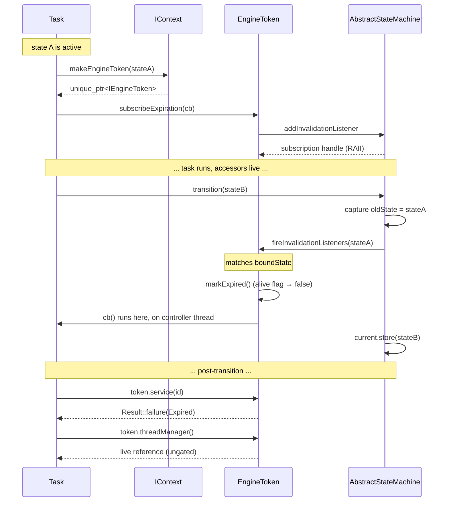

# Engine token (R-StateScope pattern)

`IEngineToken` is the state-scoped DI handle the engine hands to a task
when the task enters a state. While the bound state stays active, the
token resolves to live views of the engine API; the moment the FSM
leaves that state, every gated accessor on the token short-circuits to
`Result::Code::Expired`. The token behaves like `std::weak_ptr` over
state lifetime: the `boundState()` and `isAlive()` introspection
accessors stay queryable forever, but the `service / system /
entityManager / components / ecs` accessors stop dereferencing
recyclable registry slots the instant the state transition completes.

This page describes the R-StateScope rule: *what the token is, why it
exists, what each accessor returns, and how the lifecycle is driven by
the state machine*. It is the entry point for tasks that need to call
into the engine from inside a state hook.

## Motivation

Without a state-scoped wrapper, a task that captures `IContext&` at
`onEnter` keeps that reference forever. After the FSM transitions to
the next state, the task may run a deferred callback that:

- looks up a service id whose registry slot has since been recycled to
  a different service object — silent type confusion, no compile-time
  signal;
- iterates entities through an `IEntityManager` whose snapshot was
  pruned by the new state's `onEnter` — stale ids, hard-to-debug
  no-ops;
- resolves an `ISystem` that the new state never registered — a null
  pointer where the original `onEnter` saw a live system.

The R-StateScope rule replaces "task captures `IContext&`" with "task
receives an `IEngineToken&` bound to its state". The token's gated
accessors check `isAlive()` first and short-circuit to a typed
`Result::Code::Expired` once the bound state has been invalidated. A
deferred callback that runs after the transition therefore observes
**one** typed reason rather than three different undefined-behaviour
modes. The cost is a single relaxed atomic load on the alive flag per
gated lookup; the saving is "FSM transitions invalidate every stale
state-scoped reference uniformly, by construction".

## Class pyramid

`IEngineToken` ships in three tiers, mirroring the
[INV-10 naming convention](../README.md) the rest of the engine
follows:

| Tier               | Class                                                                                                   | Role                                                                                                                                                                            |
|--------------------|---------------------------------------------------------------------------------------------------------|---------------------------------------------------------------------------------------------------------------------------------------------------------------------------------|
| Pure interface     | [`IEngineToken`](../../include/vigine/api/engine/iengine_token.h) (#220)                                | No state, no method bodies. Declares the full accessor surface plus `boundState`, `isAlive`, and `subscribeExpiration`.                                                         |
| Stateful base      | [`AbstractEngineToken`](../../include/vigine/api/engine/abstractengine_token.h) (#220)                  | Owns the two pieces of token state every concrete subclass shares: an immutable `boundState` and an atomic `_alive` flag. Implements `boundState()` and `isAlive()` on top.     |
| Concrete `final`   | [`EngineToken`](../../include/vigine/impl/engine/enginetoken.h) (#287)                                  | Seals the chain. Wires the gated accessors through `IContext`, registers the FSM invalidation listener, and exposes `subscribeExpiration` over an internal callback registry.   |

Tasks always see the pure-interface tier: the state machine hands them
an `IEngineToken&`, never a concrete `EngineToken*`.

## Hybrid gating model

The token API is split into two halves on purpose. The split is the
heart of the R-StateScope rule:

### Domain accessors (gated, return `Result<T>`)

| Accessor                        | Resource                          | Failure modes                                            |
|---------------------------------|-----------------------------------|----------------------------------------------------------|
| `service(ServiceId id)`         | `vigine::service::IService&`      | `Expired`, `NotFound`                                    |
| `system(SystemId id)`           | `vigine::ecs::ISystem&`           | `Expired`, `NotFound`, `Unavailable` (#197 follow-up)    |
| `entityManager()`               | `vigine::IEntityManager&`         | `Expired`, `Unavailable` (#197 follow-up)                |
| `components()`                  | `vigine::IComponentManager&`      | `Expired`, `Unavailable` (#197 follow-up)                |
| `ecs()`                         | `vigine::ecs::IECS&`              | `Expired`, `NotFound`                                    |

These resources sit in registries the engine may recycle between ticks
or across state transitions. The first thing each gated accessor does
is `isAlive()`: a `false` return short-circuits to
`Result::Code::Expired` without ever reaching the context. While the
token is still alive, the call delegates to `IContext` and translates
the lookup outcome into the `Result` wrapper. Callers branch on
`code()` and pull the live reference through `value()`:

```cpp
auto outcome = token.service(myServiceId);
if (!outcome.ok()) {
    // outcome.code() is Expired, NotFound, or Unavailable.
    return outcome.code() == decltype(outcome)::Code::Expired
        ? Result(Result::Code::Skip)
        : Result(Result::Code::Error, "service unavailable");
}
vigine::service::IService& svc = outcome.value();
// ... safe to use svc until the next state transition.
```

### Infrastructure accessors (non-gated, return `T&`)

| Accessor              | Resource                                              | Why ungated                                                                                                                                |
|-----------------------|-------------------------------------------------------|--------------------------------------------------------------------------------------------------------------------------------------------|
| `threadManager()`     | `vigine::core::threading::IThreadManager&`            | Built first in the context construction chain, torn down last. Outlives every state.                                                       |
| `systemBus()`         | `vigine::messaging::IMessageBus&`                     | Engine-wide message bus. Owned by the context for its whole lifetime.                                                                      |
| `signalEmitter()`     | `vigine::messaging::ISignalEmitter&`                  | The engine-wide signal emitter façade. Falls back to a file-private no-op stub when the wiring follow-up under #283 has not yet landed.    |
| `stateMachine()`      | `vigine::statemachine::IStateMachine&`                | The state machine that drives the token itself. By construction outlives every token it has issued.                                        |

These accessors return references directly because the resources
behind them are engine-lifetime singletons. A task that has
already-expired its token can still drain in-flight `threadManager()`
work, post a follow-up `systemBus()` message, or query
`stateMachine().current()` to see where the FSM has moved. **Reaching
into a domain accessor after expiration is a bug; reaching into an
infrastructure accessor after expiration is the supported path for
graceful drain.**

The split is intentional. A task that has been dropped on a state
transition still needs to drain. Forcing every accessor through the
gate would make the drain path itself fail, defeating the purpose of
"graceful state hand-off". The hybrid policy lets domain code fail
loudly while infrastructure code keeps working.

## Self-destruct contract

A task that needs to react to its own expiration registers a callback
through `subscribeExpiration`:

```cpp
auto sub = token.subscribeExpiration([&]() {
    // FSM has transitioned away from boundState. Cancel any deferred
    // pool work this task posted, drop cached service handles, etc.
    cancelInFlightDecode();
});
```

Contract:

- The callback is invoked **exactly once**, when the FSM transitions
  away from the bound state. A second transition does not re-fire it.
- The callback runs **synchronously on the controller thread** —
  whichever thread executed the FSM transition. The
  [`IStateMachine` thread-affinity contract](../sequence-engine-state.md)
  guarantees that this is the controller thread.
- The callback runs **before** any `onExit` hook of the vacated state,
  inside `AbstractStateMachine::fireInvalidationListeners`, so a
  callback that calls back into `stateMachine().current()` observes the
  **old** active state and not the new one.
- `subscribeExpiration` returns `nullptr` when the supplied callback
  is empty or when the token is already expired at registration time
  — there is nothing left to fire. **Always null-check the returned
  `unique_ptr<ISubscriptionToken>` before dereferencing it.**
- Dropping the returned subscription token before expiration cleanly
  detaches the callback. The token holds the subscription as RAII; no
  manual `cancel()` is required for the common case.

## Lifecycle and FSM hook

The state machine drives the token's lifecycle through an
invalidation-listener registry on `AbstractStateMachine`. The flow
below shows what happens on a non-noop transition.



Two ordering details worth highlighting:

1. **Listeners fire BEFORE `_current` flips.** `transition()` captures
   `oldState` first, calls `fireInvalidationListeners(oldState)`, and
   *then* stores the new state. A listener that calls back into
   `stateMachine().current()` therefore sees the OLD active state, not
   the NEW one. This ordering is asserted in the engine-token smoke
   suite (`test/engine_token/smoke_test.cpp`).
2. **No-op transitions do not fire the listener.** A
   `transition(stateA)` call when `_current == stateA` returns success
   with no side effect, and no token bound to `stateA` is invalidated.
   Idempotent `transition(currentState)` is therefore safe.

A bus-level signal payload —
[`StateInvalidatedPayload`](../../include/vigine/api/messaging/payload/stateinvalidatedpayload.h) —
ships under the messaging tree to let signal-emitter subscribers
observe the same event without owning a token. Its emission from
inside the FSM transition path is a follow-up issue (the payload
header lands first so payload registration code can compile against
the contract). Once the emitter wiring lands, FSM transitions will
publish the payload on the system bus immediately after the listener
broadcast above, on the same controller thread, before `_current` is
flipped to the new state.

## Code example

A task that wants both a service handle and a clean-up hook on
state-exit looks like this. The example mirrors the engine-token smoke
suite (`test/engine_token/smoke_test.cpp`) which is the canonical
reference for the contract.

```cpp
#include "vigine/api/context/factory.h"
#include "vigine/api/context/icontext.h"
#include "vigine/api/engine/iengine_token.h"
#include "vigine/api/messaging/isubscriptiontoken.h"
#include "vigine/api/service/serviceid.h"
#include "vigine/result.h"

void runStateScopedWork(vigine::IContext &ctx,
                        vigine::statemachine::StateId boundState,
                        vigine::service::ServiceId    workerId)
{
    // 1. Mint a token bound to the current state. The state machine
    //    hands one of these out automatically on a real onEnter; the
    //    explicit factory call here is the unit-test-style shape.
    auto token = ctx.makeEngineToken(boundState);
    if (!token) {
        return; // legacy stub context cannot mint a live token.
    }

    // 2. Register a clean-up hook before any side effect. The lambda
    //    fires once on the controller thread when the FSM leaves
    //    boundState, before _current flips to the new state.
    auto sub = token->subscribeExpiration([]() {
        // cancel deferred decoder work, drop cached handles, etc.
    });

    // 3. Resolve a domain handle through the gated accessor.
    auto outcome = token->service(workerId);
    if (!outcome.ok()) {
        // Three failure modes:
        //   - Expired:     state has already changed — bail out.
        //   - NotFound:    workerId is the invalid sentinel or its
        //                  registry slot has been recycled.
        //   - Unavailable: the underlying surface is still
        //                  initialising or has been torn down.
        return;
    }
    vigine::service::IService &worker = outcome.value();

    // 4. Reach an infrastructure resource through the ungated
    //    accessor. Even after the token expires, this reference
    //    keeps working — that is what lets a task drain in-flight
    //    pool work after a state transition.
    vigine::core::threading::IThreadManager &tm = token->threadManager();
    (void)tm.schedule([&worker]() {
        // ... background work that may outlive the token ...
    }, vigine::core::threading::ThreadAffinity::Pool);
}
```

The two failure modes a task **must** handle:

- `outcome.ok() == false` and `outcome.code() == Expired` — the FSM
  has moved on. Skip the work; the bookkeeping has already been done
  by the expiration callback registered in step 2. The smoke suite's
  scenario 2 exercises exactly this path.
- `sub == nullptr` from `subscribeExpiration` — either the lambda was
  empty or the token was already expired at registration time. The
  smoke suite's scenario 3 exercises the latter.

## Cross-references

- Pure interface, gating-policy contract:
  [`include/vigine/api/engine/iengine_token.h`](../../include/vigine/api/engine/iengine_token.h)
  (#220).
- Stateful base (alive flag, bound-state accessor):
  [`include/vigine/api/engine/abstractengine_token.h`](../../include/vigine/api/engine/abstractengine_token.h)
  (#220).
- Concrete final + FSM listener wiring:
  [`include/vigine/impl/engine/enginetoken.h`](../../include/vigine/impl/engine/enginetoken.h),
  [`src/impl/engine/enginetoken.cpp`](../../src/impl/engine/enginetoken.cpp)
  (#287).
- Factory on the context:
  [`IContext::makeEngineToken`](../../include/vigine/api/context/icontext.h)
  (#286).
- FSM-side invalidation registry and listener firing path:
  [`AbstractStateMachine::addInvalidationListener` / `fireInvalidationListeners`](../../include/vigine/api/statemachine/abstractstatemachine.h)
  (#287).
- Bus-level signal payload (header only; emission wiring follows):
  [`StateInvalidatedPayload`](../../include/vigine/api/messaging/payload/stateinvalidatedpayload.h).
- Reference smoke suite for the contract:
  [`test/engine_token/smoke_test.cpp`](../../test/engine_token/smoke_test.cpp)
  (#287).
- Threading contract for the controller thread the listener path runs
  on: [`doc/threading/overview.md`](../threading/overview.md).
