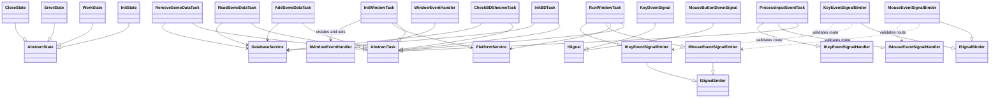

# Example Class Diagram

```mermaid
classDiagram
direction TB

class InitState
class WorkState
class ErrorState
class CloseState
class AbstractState

class InitWindowTask
class RunWindowTask
class ProcessInputEventTask
class InitBDTask
class CheckBDShecmeTask
class AddSomeDataTask
class ReadSomeDataTask
class RemoveSomeDataTask
class AbstractTask

class WindowEventHandler
class IWindowEventHandler
class PlatformService
class DatabaseService

class MouseButtonDownSignal
class KeyDownSignal
class ISignal

class IMouseEventSignalEmiter
class IKeyEventSignalEmiter
class IMouseEventSignalHandler
class IKeyEventSignalHandler
class MouseEventSignalBinder
class KeyEventSignalBinder
class ISignalEmiter
class ISignalBinder

InitState --|> AbstractState
WorkState --|> AbstractState
ErrorState --|> AbstractState
CloseState --|> AbstractState

InitWindowTask --|> AbstractTask
RunWindowTask --|> AbstractTask
ProcessInputEventTask --|> AbstractTask
InitBDTask --|> AbstractTask
CheckBDShecmeTask --|> AbstractTask
AddSomeDataTask --|> AbstractTask
ReadSomeDataTask --|> AbstractTask
RemoveSomeDataTask --|> AbstractTask

WindowEventHandler --|> IWindowEventHandler
InitWindowTask --> PlatformService
InitWindowTask --> IWindowEventHandler : creates and sets
RunWindowTask --> PlatformService

RunWindowTask --|> IMouseEventSignalEmiter
RunWindowTask --|> IKeyEventSignalEmiter
ProcessInputEventTask --|> IMouseEventSignalHandler
ProcessInputEventTask --|> IKeyEventSignalHandler

MouseButtonDownSignal --|> ISignal
KeyDownSignal --|> ISignal

IMouseEventSignalEmiter --|> ISignalEmiter
IKeyEventSignalEmiter --|> ISignalEmiter
MouseEventSignalBinder --|> ISignalBinder
KeyEventSignalBinder --|> ISignalBinder

MouseEventSignalBinder ..> IMouseEventSignalEmiter : validates route
MouseEventSignalBinder ..> IMouseEventSignalHandler : validates route
KeyEventSignalBinder ..> IKeyEventSignalEmiter : validates route
KeyEventSignalBinder ..> IKeyEventSignalHandler : validates route

InitBDTask --> DatabaseService
CheckBDShecmeTask --> DatabaseService
AddSomeDataTask --> DatabaseService
ReadSomeDataTask --> DatabaseService
RemoveSomeDataTask --> DatabaseService
```
