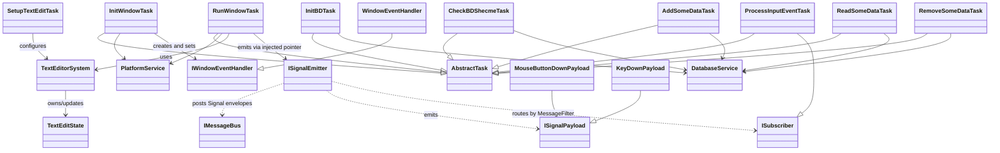

# Example Class Diagram

```mermaid
classDiagram
direction TB

class InitWindowTask
class RunWindowTask
class SetupTextEditTask
class TextEditorSystem
class TextEditState
class ProcessInputEventTask
class InitBDTask
class CheckBDShecmeTask
class AddSomeDataTask
class ReadSomeDataTask
class RemoveSomeDataTask
class AbstractTask

class WindowEventHandler
class IWindowEventHandler
class PlatformService
class DatabaseService

class MouseButtonDownPayload
class KeyDownPayload
class ISignalPayload

class ISignalEmitter
class ISubscriber
class IMessageBus

InitWindowTask --|> AbstractTask
RunWindowTask --|> AbstractTask
ProcessInputEventTask --|> AbstractTask
InitBDTask --|> AbstractTask
CheckBDShecmeTask --|> AbstractTask
AddSomeDataTask --|> AbstractTask
ReadSomeDataTask --|> AbstractTask
RemoveSomeDataTask --|> AbstractTask

WindowEventHandler --|> IWindowEventHandler
InitWindowTask --> PlatformService
InitWindowTask --> IWindowEventHandler : creates and sets
RunWindowTask --> PlatformService
RunWindowTask --> TextEditorSystem : uses
SetupTextEditTask --> TextEditorSystem : configures
TextEditorSystem --> TextEditState : owns/updates

RunWindowTask --> ISignalEmitter : emits via injected pointer
ProcessInputEventTask --|> ISubscriber

MouseButtonDownPayload --|> ISignalPayload
KeyDownPayload --|> ISignalPayload

ISignalEmitter ..> IMessageBus : posts Signal envelopes
ISignalEmitter ..> ISignalPayload : emits
ISignalEmitter ..> ISubscriber : routes by MessageFilter

InitBDTask --> DatabaseService
CheckBDShecmeTask --> DatabaseService
AddSomeDataTask --> DatabaseService
ReadSomeDataTask --> DatabaseService
RemoveSomeDataTask --> DatabaseService
```
