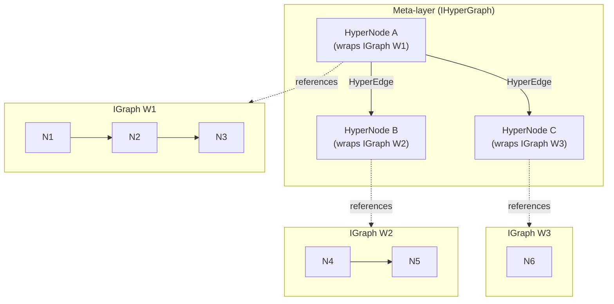

# Design Sketch: IHyperGraph API (v1.1+)

> This document is a **forward-looking design sketch** only.
> Nothing described here is shipped in v1. It records the intended
> direction so v1 authors know what the meta-layer will look like and
> can avoid locking in patterns that would conflict with it.
>
> _Last hygiene scan: 2026-04-22._

---

## Contents

1. [Motivation](#motivation)
2. [API surface sketch](#api-surface-sketch)
3. [Relationship to IGraph](#relationship-to-igraph)
4. [Out-of-scope for v1](#out-of-scope-for-v1)
5. [v1.1+ roadmap entry point](#v11-roadmap-entry-point)
6. [Open questions](#open-questions)

---

## Motivation

The v1 graph layer (`IGraph` / `INode` / `IEdge`) models the topology
of a **single wrapper**: one graph, one set of nodes, one set of edges.
That is sufficient for intra-wrapper navigation and queries. It is not
sufficient once the engine needs to reason across wrappers — for example:

| Need | Why IGraph alone falls short |
|------|------------------------------|
| Cross-wrapper visualisation | Each wrapper owns its own graph; there is no shared canvas to place them on together. |
| Meta-graph queries (cycles, reachability) | Cycles that span two wrappers require a view that joins both graphs. |
| Global tooling (auto cascade-delete, dependency ordering) | Cascade logic must walk edges that cross wrapper boundaries, which `IGraph` does not model. |

`IHyperGraph` addresses this by introducing a **meta-layer** above the
plain-graph level. A hypergraph node represents an entire `IGraph`
(one wrapper), and a hypergraph edge represents a directed relationship
between two wrappers. The result is a graph-of-graphs: the same
interface concepts (`INode`, `IEdge`) apply, but at one level higher.

---

## API surface sketch

The method signatures below are **reference-quality**, not final.
Names, parameter types, and return conventions may change before the
first real implementation leaf.

```cpp
// include/vigine/hypergraph/ihypergraph.h  (v1.1+, does not exist yet)

namespace vigine::hypergraph {

class IHyperGraph {
public:
    virtual ~IHyperGraph() = default;

    // Register an IGraph instance as a node in the meta-graph. Returns
    // an opaque HyperNodeId; caller retains ownership of the graph.
    //
    // Lifetime: the caller guarantees the passed `IGraph` outlives its
    // hypergraph registration. Call `unregisterWrapper(id)` before
    // destroying the wrapped graph, otherwise meta-edges that reference
    // the freed graph become dangling.
    virtual HyperNodeId registerWrapper(vigine::core::graph::IGraph *graph,
                                        std::string_view       label) = 0;

    // Add a directed meta-edge between two wrapper nodes.
    virtual HyperEdgeId link(HyperNodeId from, HyperNodeId to) = 0;

    // Remove a previously registered wrapper and all its meta-edges.
    virtual void unregisterWrapper(HyperNodeId id) = 0;

    // Export the entire meta-graph in Graphviz DOT format. The signature
    // matches `vigine::core::graph::IGraph::exportGraphViz` — caller-owned
    // buffer, Result error path, no I/O on the interface.
    virtual vigine::Result exportGraphViz(std::string &out) const = 0;

    // Return all cycle paths in the meta-graph (depth-first). Each inner
    // vector is one cycle expressed as a sequence of HyperNodeIds.
    virtual std::vector<std::vector<HyperNodeId>> findCycles() const = 0;

    // Iterate registered wrapper nodes.
    virtual void forEachWrapper(
        std::function<void(HyperNodeId, vigine::core::graph::IGraph *)> fn) const = 0;
};

} // namespace vigine::hypergraph
```

The engine would expose `IHyperGraph` through `Context` or a dedicated
service — the exact attachment point is an open question (see Q-HG2).

---

## Relationship to IGraph



Key design invariants:

| Aspect | Rule |
|--------|------|
| Ownership | `IHyperGraph` does **not** own the `IGraph` instances it references. Ownership stays with the wrapper. |
| Node granularity | One `IGraph` = one `HyperNode`. Sub-graph groupings within a single `IGraph` are not exposed at the meta-level. |
| Edge semantics | A `HyperEdge` records a directed dependency between wrappers (e.g., "W1 consumes output from W2"). Meta-tools such as `findCycles()` and the cascade-delete motivating use cases DO interpret it — all edges are treated as dependency edges for ordering and reachability. Callers that want to attach additional payload (a reason string, a tag) can do so through a caller-defined sidecar map keyed on `HyperEdgeId`; the interface itself stays narrow. Edge labels, weights, or non-dependency semantics are out of scope for v1.1; they would land in a later revision. |
| Concurrency | Not specified in this sketch; left for Q-HG4. |

The plain `IGraph` interface is **unchanged**. An `IGraph` has no
knowledge of whether it is registered in a hypergraph; `IHyperGraph`
holds all the meta-level state.

---

## Out-of-scope for v1

Everything in this document is deferred. The list below is explicit so
that v1 review can confirm none of it leaked into the v1 milestone.

| Item | Status |
|------|--------|
| `include/vigine/hypergraph/` header directory | Not created in v1 |
| `IHyperGraph` class (any form) | Not implemented in v1 |
| `HyperNodeId` / `HyperEdgeId` types | Not defined in v1 |
| CMake target for hypergraph | Not added in v1 |
| `engine.hyperGraph()` accessor on `Engine` or `Context` | Not added in v1 |
| `exportGraphViz()` implementation | Not implemented in v1 |
| `findCycles()` implementation | Not implemented in v1 |
| Tests for any of the above | Not written in v1 |

If any of these items appear in a v1 PR, that PR should be flagged for
deferral to v1.1.

---

## v1.1+ roadmap entry point

When the v1.1 implementation leaf is planned, it would begin with:

1. **Create `include/vigine/hypergraph/IHyperGraph.h`** — finalise the
   method signatures sketched above, resolving open questions Q-HG1 to
   Q-HG4.
2. **Create `src/hypergraph/DefaultHyperGraph.cpp`** — a concrete
   implementation backed by an internal `IGraph` instance (each `IGraph`
   wrapper becomes a node in that internal graph; meta-edges become plain
   graph edges).
3. **Register a CMake target** `vigine_hypergraph` and add it to the
   top-level build.
4. **Expose via `Context`** — add `Context::hyperGraph()` returning
   `IHyperGraph*` (or a smart-pointer equivalent, pending Q-HG2).
5. **Write tests** — unit tests for `registerWrapper`, `link`,
   `findCycles`, and `exportGraphViz`.

The internal implementation strategy (another `IGraph` instance at the
meta-level) keeps the hypergraph consistent with the plain-graph
abstraction and avoids introducing a separate adjacency-list
implementation.

For deeper background on why this design was deferred and what
alternatives were considered, see the analysis artefact that will
accompany the first v1.1 implementation leaf. (Previous revisions of
this doc linked at a path in a separate repository; that cross-repo
link has been removed — the background document will live alongside
the implementation inside this engine tree when it lands.)

---

## Open questions

These questions must be resolved before the first v1.1 implementation
leaf begins.

**Q-HG1** — Should `HyperNodeId` and `HyperEdgeId` be strong typedefs
over `size_t`, or should they be full wrapper classes with equality and
hash support? Decision affects the public API stability guarantee.

**Q-HG2** — Where does `IHyperGraph` live in the ownership hierarchy?
Options: (a) owned by `Engine` directly, exposed via `engine.hyperGraph()`;
(b) owned by a dedicated `HyperGraphService : AbstractService`, accessed
through `Context`; (c) a free-standing object the caller owns and passes
to whichever wrappers need registration. Option (b) is the current
preference because it follows the existing service pattern, but it is not
final.

**Q-HG3** — Should `exportGraphViz()` write to a `std::string` (current
sketch), an `std::ostream`, or a file path? The file-path variant is
friendlier for tooling but couples the interface to I/O.

**Q-HG4** — Concurrency model: is `IHyperGraph` expected to be
thread-safe, or does it carry the same "single-thread access" contract
as `IGraph`? If thread-safe, which operations need to be atomic
(registration vs. traversal vs. export)?
