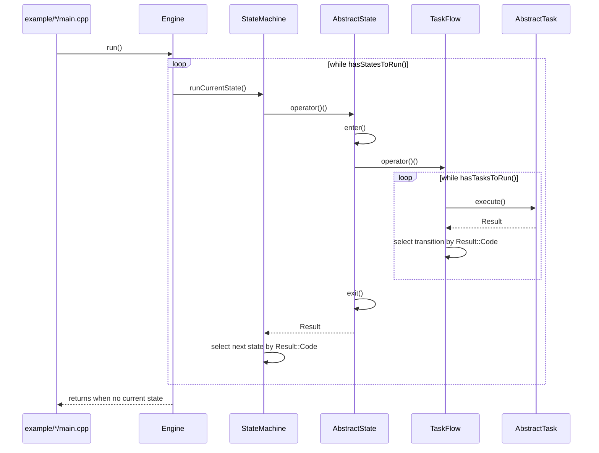

# Sequence Diagram: Engine Run and State Transitions

```mermaid
sequenceDiagram
participant Main as example/*/main.cpp
participant Engine
participant SM as StateMachine
participant State as AbstractState
participant TF as TaskFlow
participant Task as AbstractTask

Main->>Engine: run()
loop while hasStatesToRun()
  Engine->>SM: runCurrentState()
  SM->>State: operator()()
  State->>State: enter()
  State->>TF: operator()()
  loop while hasTasksToRun()
    TF->>Task: execute()
    Task-->>TF: Result
    TF->>TF: select transition by Result::Code
  end
  State->>State: exit()
  State-->>SM: Result
  SM->>SM: select next state by Result::Code
end
Engine-->>Main: returns when no current state
```
