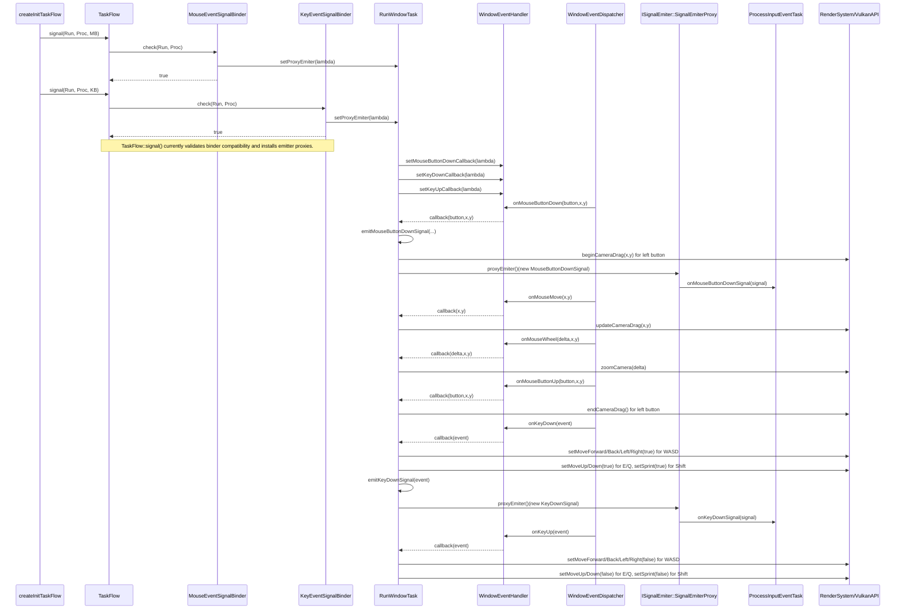

# Sequence Diagram: Window Input Signal Dispatch

## Keyboard And Mouse Controls

- `W` move camera forward.
- `S` move camera backward.
- `A` strafe camera left.
- `D` strafe camera right.
- `E` move camera up.
- `Q` move camera down.
- `Shift` hold to enable sprint multiplier for movement speed.
- `Left Mouse Button + Move` mouse-look (camera yaw/pitch).
- `Mouse Wheel` move camera forward/backward along current view direction.
