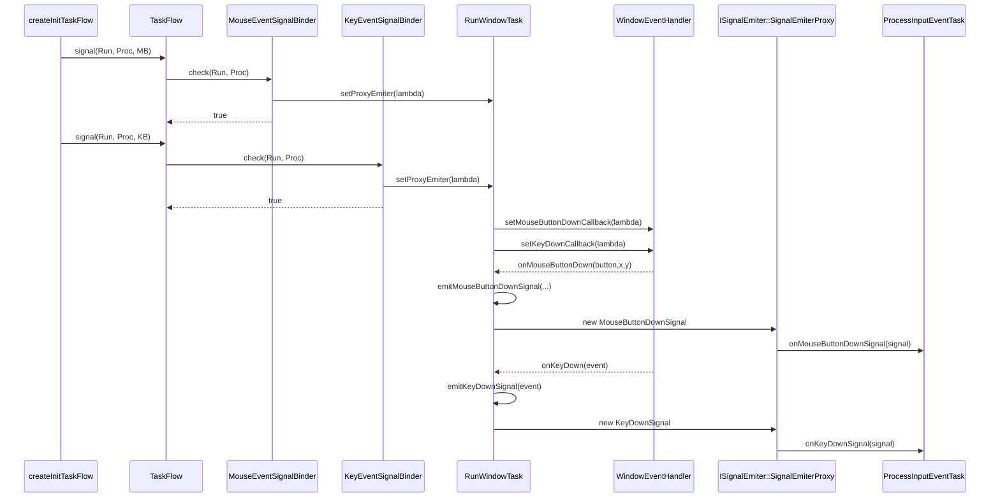

# Sequence Diagram: Window Input Signal Dispatch

```mermaid
sequenceDiagram
participant Main as createInitTaskFlow
participant TF as TaskFlow
participant MB as MouseEventSignalBinder
participant KB as KeyEventSignalBinder
participant Run as RunWindowTask
participant Handler as WindowEventHandler
participant Proxy as ISignalEmiter::SignalEmiterProxy
participant Proc as ProcessInputEventTask

Main->>TF: signal(Run, Proc, MB)
TF->>MB: check(Run, Proc)
MB->>Run: setProxyEmiter(lambda)
MB-->>TF: true

Main->>TF: signal(Run, Proc, KB)
TF->>KB: check(Run, Proc)
KB->>Run: setProxyEmiter(lambda)
KB-->>TF: true

Run->>Handler: setMouseButtonDownCallback(lambda)
Run->>Handler: setKeyDownCallback(lambda)

Handler-->>Run: onMouseButtonDown(button,x,y)
Run->>Run: emitMouseButtonDownSignal(...)
Run->>Proxy: new MouseButtonDownSignal
Proxy->>Proc: onMouseButtonDownSignal(signal)

Handler-->>Run: onKeyDown(event)
Run->>Run: emitKeyDownSignal(event)
Run->>Proxy: new KeyDownSignal
Proxy->>Proc: onKeyDownSignal(signal)
```
