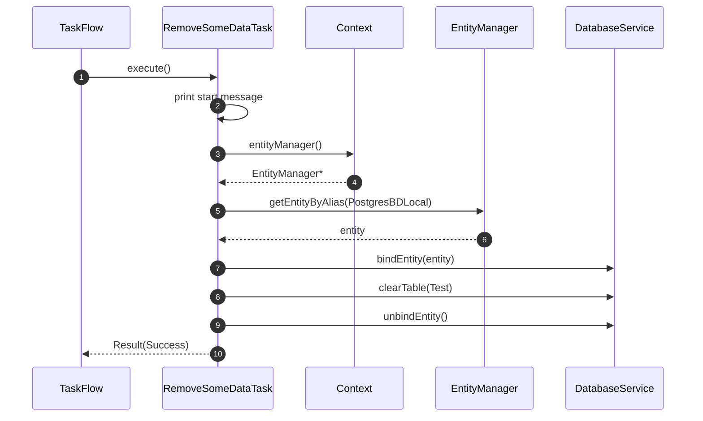

# RemoveSomeDataTask

```mermaid
sequenceDiagram
autonumber
participant Caller as TaskFlow
participant T as RemoveSomeDataTask
participant Ctx as Context
participant EM as EntityManager
participant DB as DatabaseService

Caller->>T: execute()
T->>T: print start message
T->>Ctx: entityManager()
Ctx-->>T: EntityManager*
T->>EM: getEntityByAlias(PostgresBDLocal)
EM-->>T: entity

T->>DB: bindEntity(entity)
T->>DB: clearTable(Test)
T->>DB: unbindEntity()
T-->>Caller: Result(Success)
```
