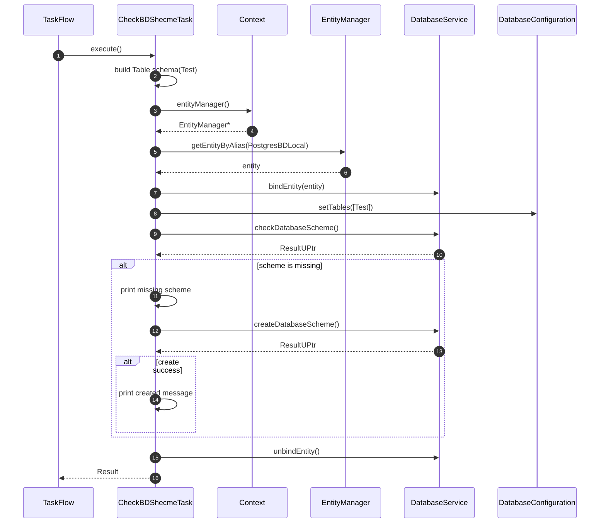

# CheckBDShecmeTask

```mermaid
sequenceDiagram
autonumber
participant Caller as TaskFlow
participant T as CheckBDShecmeTask
participant Ctx as Context
participant EM as EntityManager
participant DB as DatabaseService
participant Cfg as DatabaseConfiguration

Caller->>T: execute()
T->>T: build Table schema(Test)
T->>Ctx: entityManager()
Ctx-->>T: EntityManager*
T->>EM: getEntityByAlias(PostgresBDLocal)
EM-->>T: entity

T->>DB: bindEntity(entity)
T->>Cfg: setTables([Test])
T->>DB: checkDatabaseScheme()
DB-->>T: ResultUPtr

alt scheme is missing
  T->>T: print missing scheme
  T->>DB: createDatabaseScheme()
  DB-->>T: ResultUPtr
  alt create success
    T->>T: print created message
  end
end

T->>DB: unbindEntity()
T-->>Caller: Result
```
