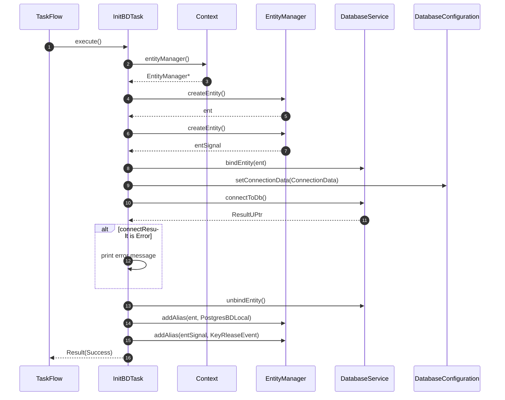

# InitBDTask

```mermaid
sequenceDiagram
autonumber
participant Caller as TaskFlow
participant T as InitBDTask
participant Ctx as Context
participant EM as EntityManager
participant DB as DatabaseService
participant Cfg as DatabaseConfiguration

Caller->>T: execute()
T->>Ctx: entityManager()
Ctx-->>T: EntityManager*
T->>EM: createEntity()
EM-->>T: ent
T->>EM: createEntity()
EM-->>T: entSignal

T->>DB: bindEntity(ent)
T->>Cfg: setConnectionData(ConnectionData)
T->>DB: connectToDb()
DB-->>T: ResultUPtr
alt connectResult is Error
  T->>T: print error message
end
T->>DB: unbindEntity()

T->>EM: addAlias(ent, PostgresBDLocal)
T->>EM: addAlias(entSignal, KeyRleaseEvent)
T-->>Caller: Result(Success)
```
