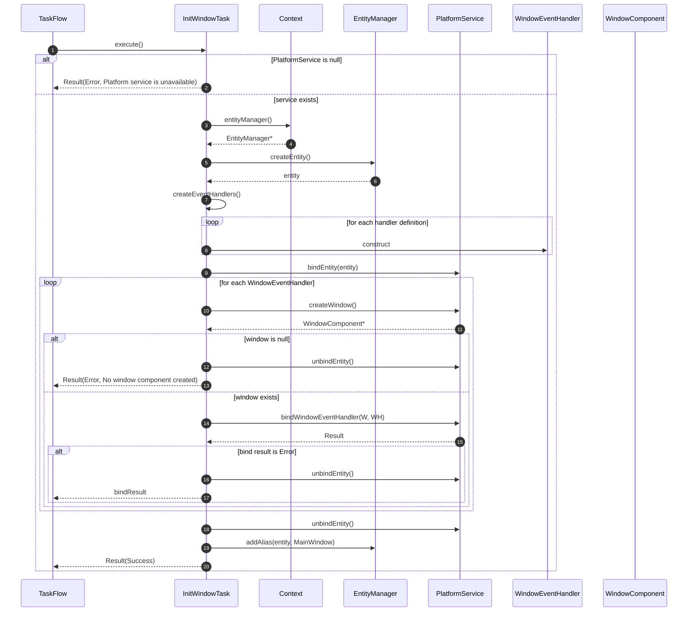

# InitWindowTask

```mermaid
sequenceDiagram
autonumber
participant Caller as TaskFlow
participant T as InitWindowTask
participant Ctx as Context
participant EM as EntityManager
participant PS as PlatformService
participant WH as WindowEventHandler
participant W as WindowComponent

Caller->>T: execute()
alt PlatformService is null
  T-->>Caller: Result(Error, Platform service is unavailable)
else service exists
  T->>Ctx: entityManager()
  Ctx-->>T: EntityManager*
  T->>EM: createEntity()
  EM-->>T: entity

  T->>T: createEventHandlers()
  loop for each handler definition
    T->>WH: construct
  end

  T->>PS: bindEntity(entity)
  loop for each WindowEventHandler
    T->>PS: createWindow()
    PS-->>T: WindowComponent*

    alt window is null
      T->>PS: unbindEntity()
      T-->>Caller: Result(Error, No window component created)
    else window exists
      T->>PS: bindWindowEventHandler(W, WH)
      PS-->>T: Result
      alt bind result is Error
        T->>PS: unbindEntity()
        T-->>Caller: bindResult
      end
    end
  end

  T->>PS: unbindEntity()

  T->>EM: addAlias(entity, MainWindow)
  T-->>Caller: Result(Success)
end
```
