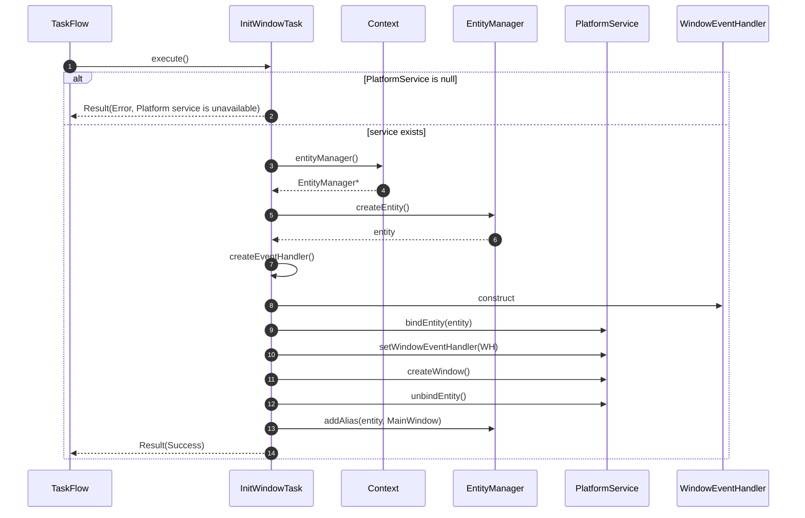

# InitWindowTask

```mermaid
sequenceDiagram
autonumber
participant Caller as TaskFlow
participant T as InitWindowTask
participant Ctx as Context
participant EM as EntityManager
participant PS as PlatformService
participant WH as WindowEventHandler

Caller->>T: execute()
alt PlatformService is null
  T-->>Caller: Result(Error, Platform service is unavailable)
else service exists
  T->>Ctx: entityManager()
  Ctx-->>T: EntityManager*
  T->>EM: createEntity()
  EM-->>T: entity

  T->>T: createEventHandler()
  T->>WH: construct

  T->>PS: bindEntity(entity)
  T->>PS: setWindowEventHandler(WH)
  T->>PS: createWindow()
  T->>PS: unbindEntity()

  T->>EM: addAlias(entity, MainWindow)
  T-->>Caller: Result(Success)
end
```
