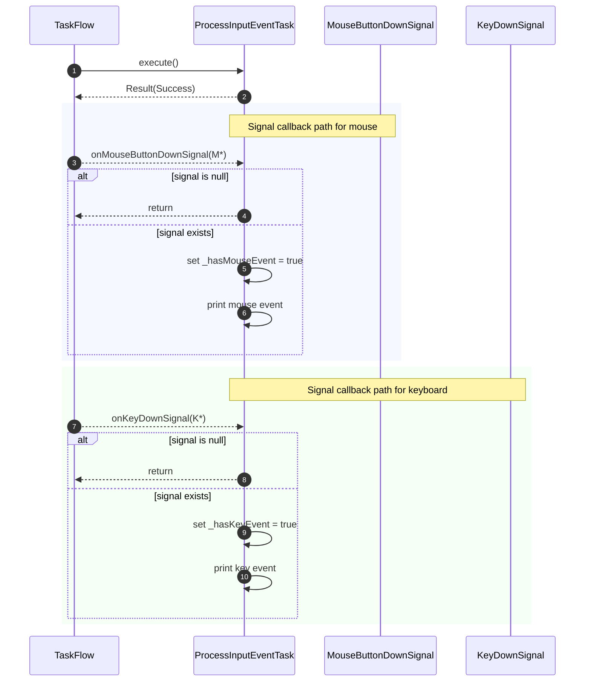

# ProcessInputEventTask

```mermaid
sequenceDiagram
autonumber
participant Caller as TaskFlow
participant T as ProcessInputEventTask
participant M as MouseButtonDownSignal
participant K as KeyDownSignal

Caller->>T: execute()
T-->>Caller: Result(Success)

rect rgb(245, 248, 255)
Note over T,M: Signal callback path for mouse
Caller-->>T: onMouseButtonDownSignal(M*)
alt signal is null
  T-->>Caller: return
else signal exists
  T->>T: set _hasMouseEvent = true
  T->>T: print mouse event
end
end

rect rgb(245, 255, 245)
Note over T,K: Signal callback path for keyboard
Caller-->>T: onKeyDownSignal(K*)
alt signal is null
  T-->>Caller: return
else signal exists
  T->>T: set _hasKeyEvent = true
  T->>T: print key event
end
end
```
