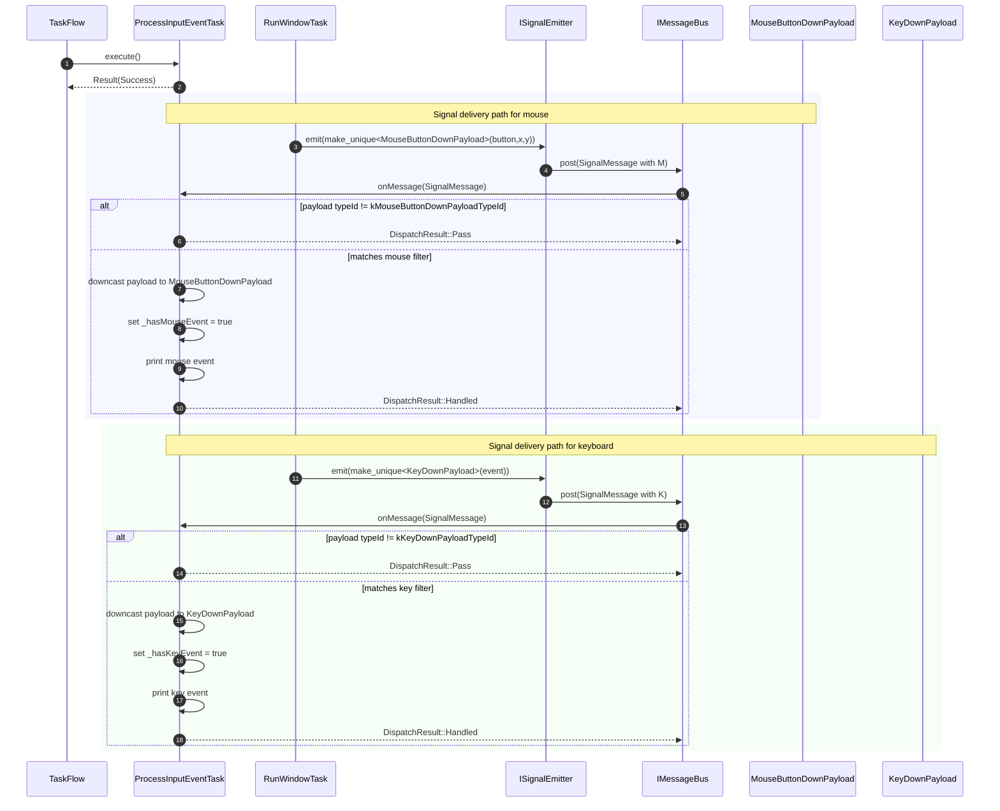

# ProcessInputEventTask

```mermaid
sequenceDiagram
autonumber
participant Caller as TaskFlow
participant T as ProcessInputEventTask
participant Run as RunWindowTask
participant Emitter as ISignalEmitter
participant Bus as IMessageBus
participant M as MouseButtonDownPayload
participant K as KeyDownPayload

Caller->>T: execute()
T-->>Caller: Result(Success)

rect rgb(245, 248, 255)
Note over T,M: Signal delivery path for mouse
Run->>Emitter: emit(make_unique<MouseButtonDownPayload>(button,x,y))
Emitter->>Bus: post(SignalMessage with M)
Bus->>T: onMessage(SignalMessage)
alt payload typeId != kMouseButtonDownPayloadTypeId
  T-->>Bus: DispatchResult::Pass
else matches mouse filter
  T->>T: downcast payload to MouseButtonDownPayload
  T->>T: set _hasMouseEvent = true
  T->>T: print mouse event
  T-->>Bus: DispatchResult::Handled
end
end

rect rgb(245, 255, 245)
Note over T,K: Signal delivery path for keyboard
Run->>Emitter: emit(make_unique<KeyDownPayload>(event))
Emitter->>Bus: post(SignalMessage with K)
Bus->>T: onMessage(SignalMessage)
alt payload typeId != kKeyDownPayloadTypeId
  T-->>Bus: DispatchResult::Pass
else matches key filter
  T->>T: downcast payload to KeyDownPayload
  T->>T: set _hasKeyEvent = true
  T->>T: print key event
  T-->>Bus: DispatchResult::Handled
end
end
```
