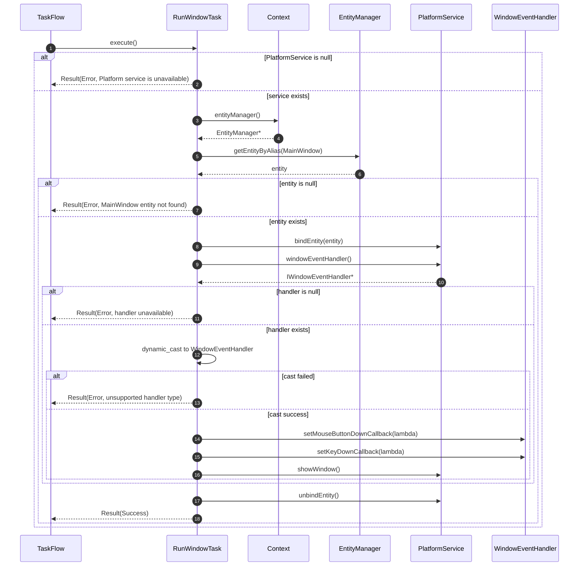

# RunWindowTask

```mermaid
sequenceDiagram
autonumber
participant Caller as TaskFlow
participant T as RunWindowTask
participant Ctx as Context
participant EM as EntityManager
participant PS as PlatformService
participant WH as WindowEventHandler

Caller->>T: execute()
alt PlatformService is null
  T-->>Caller: Result(Error, Platform service is unavailable)
else service exists
  T->>Ctx: entityManager()
  Ctx-->>T: EntityManager*
  T->>EM: getEntityByAlias(MainWindow)
  EM-->>T: entity

  alt entity is null
    T-->>Caller: Result(Error, MainWindow entity not found)
  else entity exists
    T->>PS: bindEntity(entity)
    T->>PS: windowEventHandler()
    PS-->>T: IWindowEventHandler*

    alt handler is null
      T-->>Caller: Result(Error, handler unavailable)
    else handler exists
      T->>T: dynamic_cast to WindowEventHandler
      alt cast failed
        T-->>Caller: Result(Error, unsupported handler type)
      else cast success
        T->>WH: setMouseButtonDownCallback(lambda)
        T->>WH: setKeyDownCallback(lambda)
        T->>PS: showWindow()
      end
    end

    T->>PS: unbindEntity()
    T-->>Caller: Result(Success)
  end
end
```
