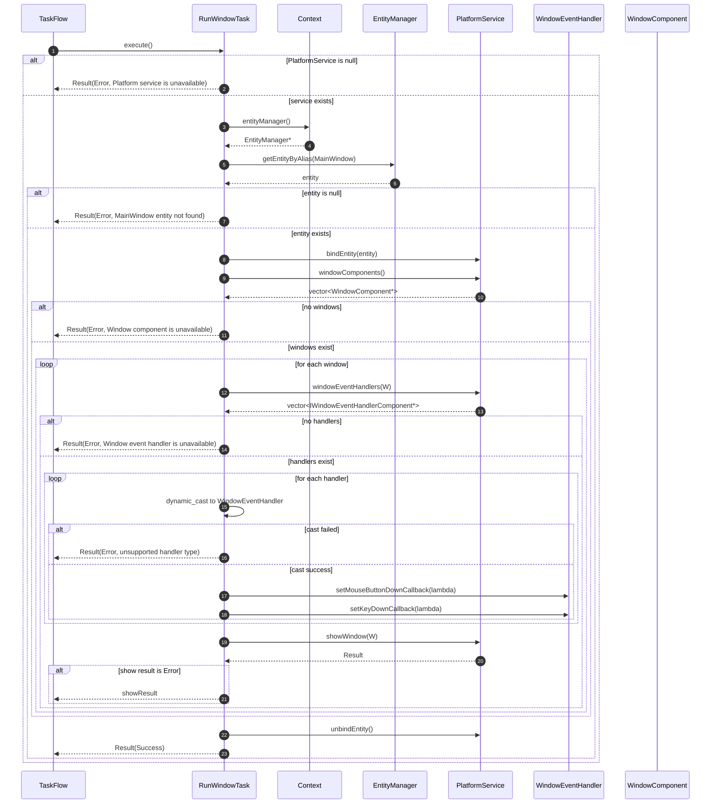

# RunWindowTask

```mermaid
sequenceDiagram
autonumber
participant Caller as TaskFlow
participant T as RunWindowTask
participant Ctx as Context
participant EM as EntityManager
participant PS as PlatformService
participant WH as WindowEventHandler
participant W as WindowComponent

Caller->>T: execute()
alt PlatformService is null
  T-->>Caller: Result(Error, Platform service is unavailable)
else service exists
  T->>Ctx: entityManager()
  Ctx-->>T: EntityManager*
  T->>EM: getEntityByAlias(MainWindow)
  EM-->>T: entity

  alt entity is null
    T-->>Caller: Result(Error, MainWindow entity not found)
  else entity exists
    T->>PS: bindEntity(entity)
    T->>PS: windowComponents()
    PS-->>T: vector<WindowComponent*>

    alt no windows
      T-->>Caller: Result(Error, Window component is unavailable)
    else windows exist
      loop for each window
        T->>PS: windowEventHandlers(W)
        PS-->>T: vector<IWindowEventHandlerComponent*>

        alt no handlers
          T-->>Caller: Result(Error, Window event handler is unavailable)
        else handlers exist
          loop for each handler
            T->>T: dynamic_cast to WindowEventHandler
            alt cast failed
              T-->>Caller: Result(Error, unsupported handler type)
            else cast success
              T->>WH: setMouseButtonDownCallback(lambda)
              T->>WH: setKeyDownCallback(lambda)
            end
          end

          T->>PS: showWindow(W)
          PS-->>T: Result
          alt show result is Error
            T-->>Caller: showResult
          end
        end
      end
    end

    T->>PS: unbindEntity()
    T-->>Caller: Result(Success)
  end
end
```
