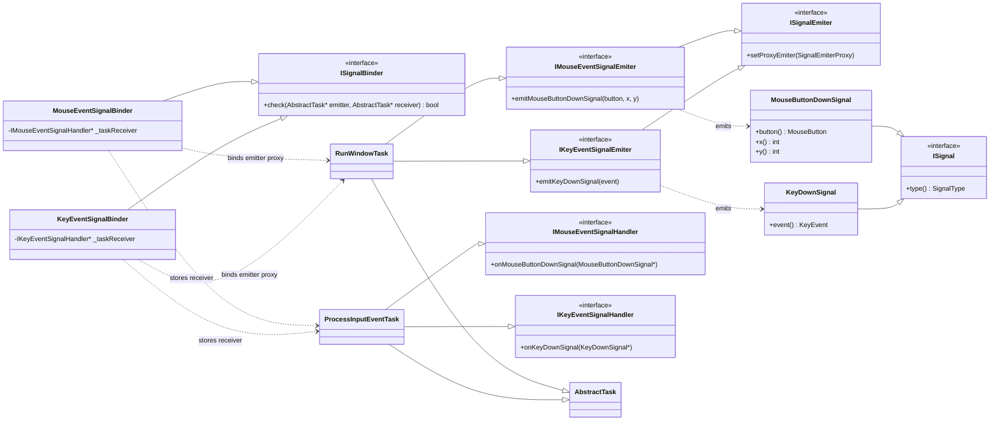
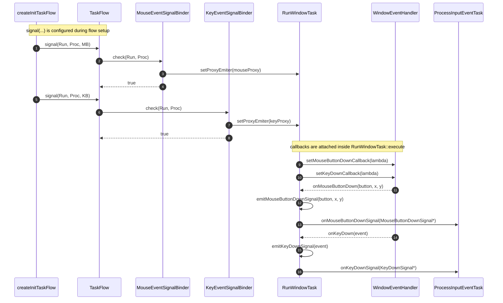

# Window Signal Subsystem Class Diagram

```mermaid
classDiagram
direction LR

class ISignal {
  <<interface>>
  +type() SignalType
}

class ISignalEmiter {
  <<interface>>
  +setProxyEmiter(SignalEmiterProxy)
}

class ISignalBinder {
  <<interface>>
  +check(AbstractTask* emitter, AbstractTask* receiver) bool
}

class MouseButtonDownSignal {
  +button() MouseButton
  +x() int
  +y() int
}

class KeyDownSignal {
  +event() KeyEvent
}

class IMouseEventSignalEmiter {
  <<interface>>
  +emitMouseButtonDownSignal(button, x, y)
}

class IKeyEventSignalEmiter {
  <<interface>>
  +emitKeyDownSignal(event)
}

class IMouseEventSignalHandler {
  <<interface>>
  +onMouseButtonDownSignal(MouseButtonDownSignal*)
}

class IKeyEventSignalHandler {
  <<interface>>
  +onKeyDownSignal(KeyDownSignal*)
}

class MouseEventSignalBinder {
  -IMouseEventSignalHandler* _taskReceiver
}

class KeyEventSignalBinder {
  -IKeyEventSignalHandler* _taskReceiver
}

class RunWindowTask
class ProcessInputEventTask
class AbstractTask

MouseButtonDownSignal --|> ISignal
KeyDownSignal --|> ISignal

IMouseEventSignalEmiter --|> ISignalEmiter
IKeyEventSignalEmiter --|> ISignalEmiter
MouseEventSignalBinder --|> ISignalBinder
KeyEventSignalBinder --|> ISignalBinder

RunWindowTask --|> AbstractTask
ProcessInputEventTask --|> AbstractTask
RunWindowTask --|> IMouseEventSignalEmiter
RunWindowTask --|> IKeyEventSignalEmiter
ProcessInputEventTask --|> IMouseEventSignalHandler
ProcessInputEventTask --|> IKeyEventSignalHandler

MouseEventSignalBinder ..> RunWindowTask : binds emitter proxy
MouseEventSignalBinder ..> ProcessInputEventTask : stores receiver
KeyEventSignalBinder ..> RunWindowTask : binds emitter proxy
KeyEventSignalBinder ..> ProcessInputEventTask : stores receiver

IMouseEventSignalEmiter ..> MouseButtonDownSignal : emits
IKeyEventSignalEmiter ..> KeyDownSignal : emits
```

# Sequence Diagram: Where The Signal Links Execute

```mermaid
sequenceDiagram
autonumber

participant Main as createInitTaskFlow
participant TF as TaskFlow
participant MB as MouseEventSignalBinder
participant KB as KeyEventSignalBinder
participant Run as RunWindowTask
participant Handler as WindowEventHandler
participant Proc as ProcessInputEventTask

Note over Main,TF: signal(...) is configured during flow setup

Main->>TF: signal(Run, Proc, MB)
TF->>MB: check(Run, Proc)
MB->>Run: setProxyEmiter(mouseProxy)
MB-->>TF: true

Main->>TF: signal(Run, Proc, KB)
TF->>KB: check(Run, Proc)
KB->>Run: setProxyEmiter(keyProxy)
KB-->>TF: true

Note over Run,Handler: callbacks are attached inside RunWindowTask::execute
Run->>Handler: setMouseButtonDownCallback(lambda)
Run->>Handler: setKeyDownCallback(lambda)

Handler-->>Run: onMouseButtonDown(button, x, y)
Run->>Run: emitMouseButtonDownSignal(button, x, y)
Run->>Proc: onMouseButtonDownSignal(MouseButtonDownSignal*)

Handler-->>Run: onKeyDown(event)
Run->>Run: emitKeyDownSignal(event)
Run->>Proc: onKeyDownSignal(KeyDownSignal*)
```
