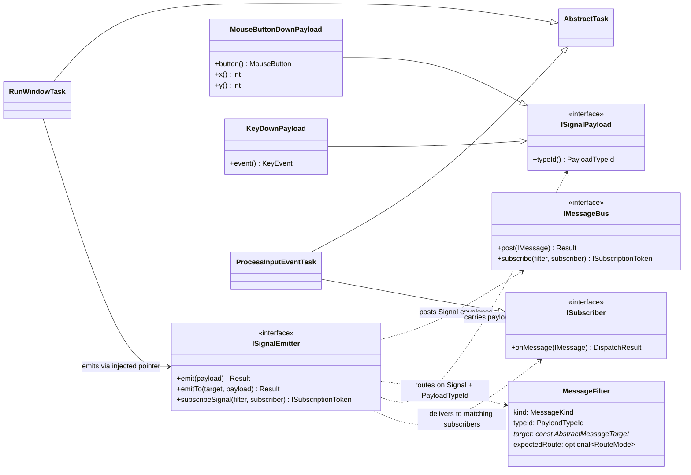
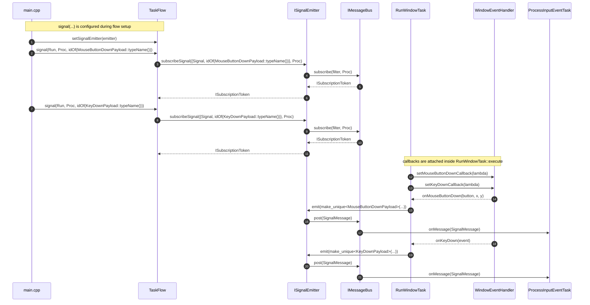

# Window Signal Subsystem Class Diagram

```mermaid
classDiagram
direction LR

class ISignalPayload {
  <<interface>>
  +typeId() PayloadTypeId
}

class ISignalEmitter {
  <<interface>>
  +emit(payload) Result
  +emitTo(target, payload) Result
  +subscribeSignal(filter, subscriber) ISubscriptionToken
}

class ISubscriber {
  <<interface>>
  +onMessage(IMessage) DispatchResult
}

class IMessageBus {
  <<interface>>
  +post(IMessage) Result
  +subscribe(filter, subscriber) ISubscriptionToken
}

class MessageFilter {
  kind: MessageKind
  typeId: PayloadTypeId
  target: const AbstractMessageTarget*
  expectedRoute: optional~RouteMode~
}

class MouseButtonDownPayload {
  +button() MouseButton
  +x() int
  +y() int
}

class KeyDownPayload {
  +event() KeyEvent
}

class RunWindowTask
class ProcessInputEventTask
class AbstractTask

MouseButtonDownPayload --|> ISignalPayload
KeyDownPayload --|> ISignalPayload

RunWindowTask --|> AbstractTask
ProcessInputEventTask --|> AbstractTask

ProcessInputEventTask --|> ISubscriber
RunWindowTask --> ISignalEmitter : emits via injected pointer

ISignalEmitter ..> IMessageBus : posts Signal envelopes
ISignalEmitter ..> MessageFilter : routes on Signal + PayloadTypeId
ISignalEmitter ..> ISignalPayload : carries payload
ISignalEmitter ..> ISubscriber : delivers to matching subscribers
```

# Sequence Diagram: Where Signal Delivery Executes

```mermaid
sequenceDiagram
autonumber

participant Main as main.cpp
participant TF as TaskFlow
participant Emitter as ISignalEmitter
participant Bus as IMessageBus
participant Run as RunWindowTask
participant Handler as WindowEventHandler
participant Proc as ProcessInputEventTask

Note over Main,TF: signal(...) is configured during flow setup

Main->>TF: setSignalEmitter(emitter)
Main->>TF: signal(Run, Proc, idOf(MouseButtonDownPayload::typeName()))
TF->>Emitter: subscribeSignal({Signal, idOf(MouseButtonDownPayload::typeName())}, Proc)
Emitter->>Bus: subscribe(filter, Proc)
Bus-->>Emitter: ISubscriptionToken
Emitter-->>TF: ISubscriptionToken

Main->>TF: signal(Run, Proc, idOf(KeyDownPayload::typeName()))
TF->>Emitter: subscribeSignal({Signal, idOf(KeyDownPayload::typeName())}, Proc)
Emitter->>Bus: subscribe(filter, Proc)
Bus-->>Emitter: ISubscriptionToken
Emitter-->>TF: ISubscriptionToken

Note over Run,Handler: callbacks are attached inside RunWindowTask::execute
Run->>Handler: setMouseButtonDownCallback(lambda)
Run->>Handler: setKeyDownCallback(lambda)

Handler-->>Run: onMouseButtonDown(button, x, y)
Run->>Emitter: emit(make_unique<MouseButtonDownPayload>(...))
Emitter->>Bus: post(SignalMessage)
Bus->>Proc: onMessage(SignalMessage)

Handler-->>Run: onKeyDown(event)
Run->>Emitter: emit(make_unique<KeyDownPayload>(...))
Emitter->>Bus: post(SignalMessage)
Bus->>Proc: onMessage(SignalMessage)
```
