# Threading overview

Vigine runs on a four-category thread model: a single controller thread
drives the main loop, a worker pool runs short-lived tasks, optional
named threads carry dedicated workloads, and a main-thread queue drains
work that must run on the application's main thread.

## Threads in the engine

The engine partitions every runnable into one of four categories. A
caller never names a physical OS thread; it names a category, and the
thread manager picks the underlying thread.

### Controller thread

The controller thread runs the engine's main loop. It is the thread
that calls `Engine::tick()` over and over: pull inputs, advance the
state machine, drain queued work, hand the frame to the renderer, and
return. Subsystems that must observe a single, stable thread of
authority — most prominently the finite-state machine — bind to this
thread on construction so that every state-machine transition is
processed in serial. The binding is asserted in debug builds; a stray
caller from another thread fires the assertion rather than corrupting
state silently. See `fsm-threading.md` for the controller-thread
invariant in full.

### Pool threads

The pool is a fixed-size set of N worker threads, sized by default to
`std::thread::hardware_concurrency()` and overridable via
`ThreadManagerConfig::poolSize`. A caller submits work via
`IThreadManager::schedule(runnable, ThreadAffinity::Pool)` (or
`ThreadAffinity::Any`, which lets the manager pick whichever free
worker is fastest to dispatch on). The pool is the right home for
short, CPU-bound, embarrassingly parallel work: per-entity updates,
batched system passes, image decompression, and similar fan-out tasks.
The `parallelFor` free helper (see `parallel-for.md`) builds on the
pool to express fan-out + barrier in one call.

### Named threads

A named thread is a caller-registered, long-lived OS thread with a
human-readable label. The caller registers it once with
`IThreadManager::registerNamedThread("audio")` and receives a
generational `NamedThreadId`. Subsequent submissions go through
`IThreadManager::scheduleOnNamed(runnable, id)` and execute strictly
in FIFO order on that one thread. Typical use cases: a dedicated audio
mixer thread that must own the audio device, a dedicated I/O thread
that serialises disk writes, or any subsystem whose API requires "all
calls from the same thread". A stale id (after
`unregisterNamedThread`) returns a failing handle and the runnable is
not executed.

### Main thread

"Main thread" is a scheduling contract, not a runtime identity check.
Whichever thread calls `IThreadManager::runMainThreadPump()` becomes
the main thread for that drain. Callers post work through
`postToMainThread(runnable)` (or `schedule(runnable, ThreadAffinity::Main)`),
and the runnable waits in an internal MPSC queue until the next pump
call drains it on the calling thread. This is the right home for
callbacks that must run on the application's main thread — typically
windowing-system integration on platforms (macOS, some Linux WM
configurations) where window and input APIs reject calls from any
other thread. The engine's main loop calls `runMainThreadPump()` once
per tick.

## Dispatch overview

```mermaid
flowchart LR
    caller[Any thread]

    subgraph TM[IThreadManager]
        direction TB
        sched[schedule&#40;runnable, affinity&#41;]
        sched_named[scheduleOnNamed&#40;runnable, id&#41;]
        post_main[postToMainThread&#40;runnable&#41;]
    end

    subgraph Threads[Physical threads]
        direction TB
        ctrl[Controller thread<br/>Engine::tick loop]
        pool[Pool worker 0..N-1<br/>FIFO per worker]
        named[Named thread<br/>e.g. audio, io]
        main[Main thread<br/>drains on runMainThreadPump]
    end

    caller --> sched
    caller --> sched_named
    caller --> post_main

    sched -- "Pool / Any" --> pool
    sched -- "Main" --> main
    sched -- "Named &#40;rejected&#41;" --> err((error Result))
    sched_named --> named
    post_main --> main

    ctrl -. drains .-> main
    ctrl -. submits work .-> sched
```

The diagram shows the three submission entry points on
`IThreadManager` and the four physical thread categories they land on.
Two notes worth calling out: the `Named` affinity must go through
`scheduleOnNamed` because the generic `schedule` path cannot carry an
id and rejects with an error `Result`; and the controller thread is
itself a caller — it submits Pool work for fan-out and drains the
main-thread queue once per tick.

## Forward links

- [`thread-affinity.md`](thread-affinity.md) — the `ThreadAffinity`
  enum and per-affinity dispatch semantics, including the closed-set
  rationale and the `Any` / `Pool` / `Main` / `Named` / `Dedicated`
  contracts.
- [`parallel-for.md`](parallel-for.md) — the `parallelFor` free
  helper that fans out an index range across the pool and joins on a
  barrier before returning.
- [`fsm-threading.md`](fsm-threading.md) — the controller-thread
  invariant for the finite-state machine, the
  `bindToControllerThread()` contract, and the dual sync / async
  transition API.

## Cross-link to messaging

Messaging dispatch (`IMessageBus`) operates on a separate notion of
thread affinity, declared per subscription on each bus rather than
through `IThreadManager`. A subscriber chooses the thread on which its
callback fires when it calls `IMessageBus::subscribe(filter, ...)`,
and the bus implementation routes published messages accordingly. The
two systems compose cleanly — a bus callback may schedule a follow-up
runnable through `IThreadManager` — but they are independently
configured. See `doc/messaging/overview.md` for the messaging-side
contract (forward reference; that document lands in a follow-up
change).
