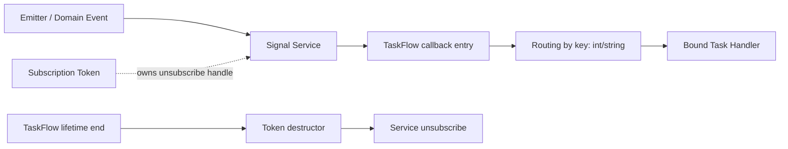
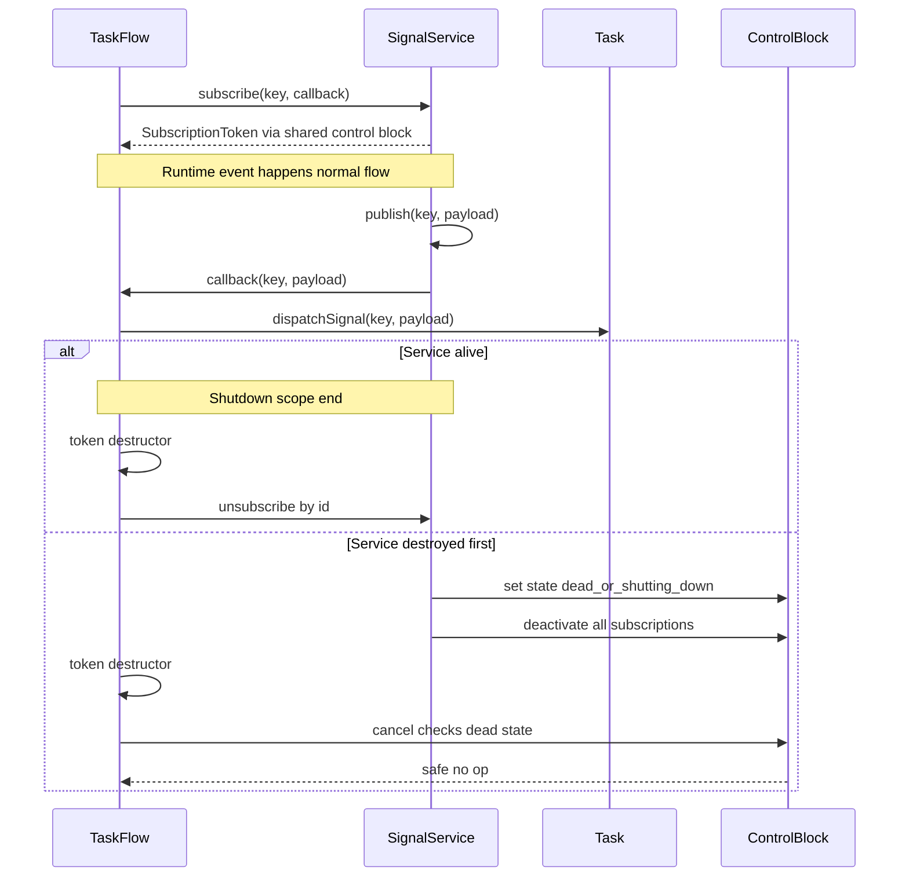
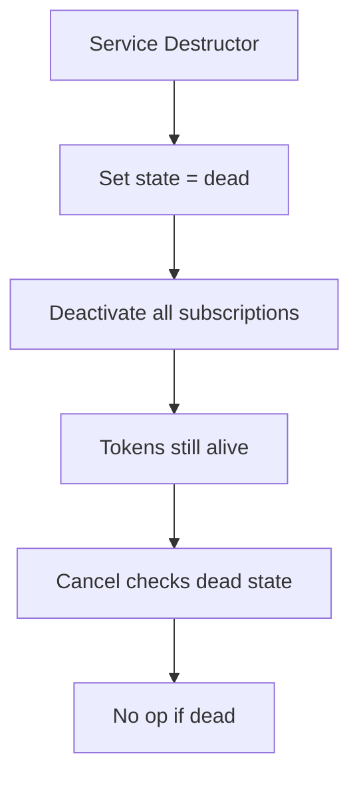

# Signal Routing Idea: Service + Subscription Token

  Architecture Proposal
  Safe Lifecycle
  Thread-Aware

  <b>Goal:</b>
  побудувати безпечну передачу сигналів між сервісом і тасками через TaskFlow,
  щоб уникнути висячих callback, жорстких залежностей та гонок при unsubscribe.

---

## 1. Проблема, яку вирішуємо

<table>
  <tr>
    <th align="left">Ризик</th>
    <th align="left">Що трапляється</th>
    <th align="left">Наслідок</th>
  </tr>
  <tr>
    <td><b>Dangling callback</b></td>
    <td>TaskFlow знищився, а сервіс ще тримає callback</td>
    <td>UAF / crash</td>
  </tr>
  <tr>
    <td><b>Direct Service -> Task</b></td>
    <td>Сервіс знає конкретні таски</td>
    <td>Сильна зв'язність, складний рефакторинг</td>
  </tr>
  <tr>
    <td><b>Race: publish vs unsubscribe</b></td>
    <td>Потоки одночасно публікують і відписують</td>
    <td>Нестабільна поведінка</td>
  </tr>
</table>

---

## 2. Ключова ідея

  <b>Підхід:</b>
  сервіс повертає <b>Subscription Token</b> під час subscribe.
  Token керує життям підписки (RAII): коли token знищується, викликається unsubscribe.

### Властивості Token

- move-only об'єкт (без копіювання)
- idempotent cancel (повторний виклик безпечний)
- автоматичний unsubscribe у деструкторі
- може підтримувати soft або strong unsubscribe semantics

### Суть ідеї простими словами

У цій схемі сервіс не дзвонить напряму в конкретний Task.
Він лише публікує сигнал за ключем, а TaskFlow приймає його і вирішує,
якому таску передати подію.

Token тут потрібен для безпеки життєвого циклу: поки token живий,
підписка активна; коли token зникає, підписка автоматично вимикається.
Тому навіть якщо об'єкти знищуються в різному порядку, система не повинна
падати через висячі callback.

Практично це дає три речі: менше зв'язаності між модулями,
керований shutdown і прогнозовану поведінку в багатопотоці.

---

## 3. Архітектурна схема

---

## 4. Послідовність викликів

---

## 5. Контракт API (концепт)

### SignalService

- subscribe(key, callback) -> SubscriptionToken
- publish(key, payload)
- unsubscribe(subscriptionId)

### SubscriptionToken

- cancel()
- active()
- destructor calls cancel()

### TaskFlow

- bindService(service)
- dispatchSignal(key, payload)

### Як token пов'язує Service і TaskFlow без сирого вказівника

1. Service зберігає підписки у control block (реєстр callback + стани).
2. Під час subscribe створюється запис підписки з унікальним <code>subscriptionId</code>.
3. Token отримує <code>subscriptionId</code> і <code>weak_ptr&lt;State&gt;</code> на control block.
4. TaskFlow передає callback-функцію в subscribe, а не pointer на себе.
5. Під час cancel токен знаходить запис за <code>subscriptionId</code> у control block і деактивує його.

Отже, зв'язок між Service і TaskFlow відбувається через контракт підписки
(subscriptionId + callback + control block), а не через сирі вказівники.

---

## 6. Thread-safety модель

  <b>Базова стратегія:</b>
  реєстр підписок захищений mutex/shared_mutex,
  publish працює через snapshot підписок,
  перед callback перевіряється active-прапор.

### Soft unsubscribe

- гарантія: після cancel не стартують нові callback
- callback, який вже стартував, може завершитися

### Strong unsubscribe

- гарантія: cancel чекає завершення in-flight callback
- реалізація: inFlight counter + condition_variable

---

## 7. Service Dies First: коли сервіс видаляється раніше

  <b>Критичний сценарій:</b>
  сервіс уже знищений, а token ще живий.
  Якщо token тримає сирий pointer на сервіс, це прямий шлях до UAF.

### Безпечне рішення

1. Token тримає не <code>Service*</code>, а спільний <b>control block</b> (shared state підписок).
2. Деструктор сервісу переводить control block у стан <code>dead/shuttingDown</code>.
3. Усі підписки деактивуються централізовано в цьому state.
4. Token::cancel() після цього працює як безпечний no-op, якщо сервіс вже dead.
5. unsubscribe залишається idempotent (повторний виклик не ламає стан).

### Де живе control block

1. Логічно control block належить сервісу і є його внутрішнім станом.
2. Технічно він алокується окремо на heap як shared state.
3. Сервіс тримає <code>shared_ptr&lt;State&gt;</code> на цей block.
4. Token тримає <code>weak_ptr&lt;State&gt;</code> і свій <code>subscriptionId</code>.
5. Control block не тримає сирих вказівників ні на Service, ні на TaskFlow.
6. У деструкторі сервісу state позначається як dead, підписки вимикаються, після чого токени роблять безпечний no-op.

Це прибирає залежність від порядку знищення об'єктів і захищає від UAF.

### Гарантії після такого дизайну

1. Порядок знищення Service і Token більше не є критичним.
2. Немає звернень до вже звільненого об'єкта сервісу.
3. Життєвий цикл підписок лишається стабільним у одно- і багатопотокових сценаріях.

---

## 8. Практичні правила інтеграції

1. Сервіс не повинен знати про конкретний Task.
2. TaskFlow є єдиною точкою маршрутизації сигналів.
3. У деструкторі TaskFlow: спочатку скасувати токени, потім звільняти інші ресурси.
4. Політику unsubscribe (soft/strong) треба явно зафіксувати в документації.
5. Callback із винятком не має валити весь dispatcher (лог + isolation).

---

## 9. Переваги підходу

  <b>Lifecycle safety:</b> немає висячих callback 
  <b>Loose coupling:</b> Service не зв'язаний з конкретними Task 
  <b>Scalability:</b> легко додавати нові сигнали (int/string key)

---

## 10. Мінімальний план впровадження (без коду тут)

1. Уточнити формат key та payload контракту.
2. Зафіксувати unsubscribe semantics (soft чи strong).
3. Додати Subscription Token в API сервісу.
4. Додати TaskFlow callback entry для dispatch.
5. Покрити тестами життєвий цикл і race-сценарії.

---

## 11. Короткий висновок

Схема Service + Subscription Token + TaskFlow dispatch дає контрольований життєвий цикл,
прибирає прямі залежності Service -> Task і створює стабільну основу як для single-thread,
так і для multi-thread сценаріїв.
